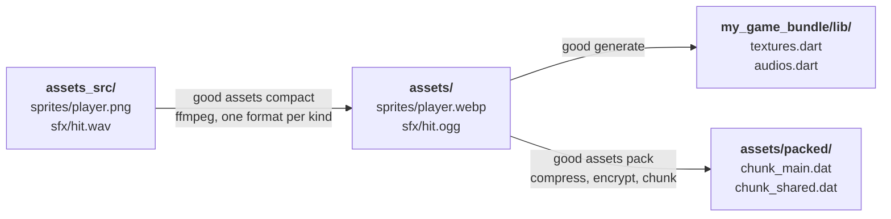

# The asset pipeline

Three stages turn the art you edit into the bytes you ship.



## Configuration

Everything is configured in the pubspec's `good:` section — not a second file
beside it. A project already has one file that says what it is and what it
ships, and this puts the asset *source* directory next to the `flutter: assets:`
list that names the *output*.

```yaml title="pubspec.yaml"
good:
  assets:
    source: assets_src/       # originals you edit and commit
    output: assets/           # canonical files, generated
    packed: assets/packed/    # release chunks, generated
    strip-originals: false    # may a build delete art it cannot rebuild
  texture:
    format: webp
    quality: 90
  audio:
    format: ogg
    quality: 5

flutter:
  assets:
    - assets/
    - assets/packed/
```

Every value shown is the default, and the whole section is optional.

| Directory | Committed? | Contents |
|---|---|---|
| `assets_src/` | **Yes** | Your originals, in whatever format you work in |
| `assets/` | Safe to gitignore | Canonical files. Rebuilt by `good assets compact` |
| `assets/packed/` | Safe to gitignore | Release chunks. Rebuilt by `good assets pack` |

Both `assets/` and `assets/packed/` must appear under `flutter: assets:` — that
list is the only thing Flutter bundles from. A release build fills `packed` and
leaves `output` alone, so both directories ship and a packed asset is bundled
twice. `strip-originals: true` empties `output` of everything the build packed;
see [Both copies ship by default](#both-copies-ship-by-default).

---

## Stage 1 — compaction

```bash
good assets compact
```

One canonical format per kind: **WebP** for images, **Ogg Vorbis** for audio.

```console
$ good assets compact
  sprites/player.png -> sprites/player.webp
1 written, 0 up to date, 0 failed.
```

The source tree's shape is preserved — `ui/button.jpg` becomes `ui/button.webp`,
not `button.webp` — because the output path is what becomes an identifier, and
flattening would create collisions the source tree avoids.

!!! info "Compaction is not a release-only step"
    Development and release load byte-identical files, because both load the
    *output* directory. A format bug that only appeared in release would be the
    worst kind, so both modes go through the same conversion.

### Incremental by default

A hash of each source plus its conversion settings is kept in
`.dart_tool/good/compact.json`, so an unchanged file is skipped:

```console
0 written, 1 up to date, 0 failed.
```

`--force` reconverts everything, which is what to reach for after changing
`quality` in the pubspec.

A file already in the canonical format is **copied, not re-encoded** —
re-encoding a WebP to WebP is generation loss, and running ffmpeg over a file
that is already right is time spent making the asset slightly worse.

### ffmpeg

Compaction needs ffmpeg and downloads one if your `PATH` has none. In CI, pass
`--no-download` to make a missing ffmpeg an explicit failure, not a slow
surprise.

### Files it has no rule for

Anything compaction cannot convert is reported as skipped, with a reason,
instead of silently dropped. Put files that are already final — a JSON level
definition, a font — directly in the output directory. Codegen does not
recognise them, so they are never packed and never stripped.

An image or audio file you put there is a different matter. It ships, so it gets
packed, and a build with `strip-originals: true` deletes the loose copy that
compaction has no source to rebuild. See
[Originals in the output directory](#originals-in-the-output-directory).

---

## Stage 2 — generation

```bash
good generate
```

Scans what the pubspec declares under `flutter: assets:` and writes four Dart
files into the generated package beside the project, along with that package's
own pubspec.

```console
$ good generate
Wrote ./my_game_bundle/pubspec.yaml
Wrote ./my_game_bundle/lib/textures.dart
Wrote ./my_game_bundle/lib/audios.dart
Wrote ./my_game_bundle/lib/good.dart
Resolving my_game_bundle - flutter pub get
1 texture(s), 0 audio file(s).
```

| File in `my_game_bundle/lib/` | Rewritten | Contents |
|---|---|---|
| `textures.dart` | every run | One enum value per shipped image |
| `audios.dart` | every run | One enum value per shipped audio file |
| `good.dart` | every run | `ensureGameReady()`, the startup check |
| `asset_key.dart` | **once** | Encryption keys, and the chunk mapping |

!!! danger "`asset_key.dart` is written once and never regenerated"
    Its keys decrypt the packs already built with them, so regenerating would
    orphan every shipped build. `good generate --rotate-keys` changes them
    deliberately — and every existing pack stops decrypting, so repack
    immediately after.

    **Commit this file.** It is generated, and it is also the only record of
    your keys.

The package is rewritten in place rather than cleared and refilled. Its code is
imported as `package:my_game_bundle/textures.dart`, so an empty bundle package
is not one waiting to be refilled — it is every asset-referencing file in the
project failing to resolve. Regenerating also runs `flutter pub get`, because a
path dependency that was never resolved does not fail the build; the build
succeeds and ships without the package.

### Subdirectories must be listed

Flutter's directory entries bundle files, not subdirectories. Compaction says so
when it notices:

```console
These directories now hold assets but are not listed under `flutter: assets:` in pubspec.yaml,
so Flutter will not bundle them and `good generate` will not see them:
  - assets/sprites/
```

```yaml
flutter:
  assets:
    - assets/
    - assets/packed/
    - assets/sprites/
```

---

## Stage 3 — packing

```bash
good assets pack
```

```console
$ good assets pack
1 asset(s) in 1 chunk(s), grouped by scene (1 scene(s); 0 asset(s) shared or unattributed).
  mode: release, encryption: aes, compression: normal
Wrote 1 chunk(s) to ./assets/packed/
  2082 bytes of assets -> 2117 bytes packed (102 per cent)
```

### Grouping by scene

Chunks are grouped so that **loading a scene reads its own chunk and at most the
shared one**. The packer scans your `lib/` statically to work out which scene
declares which asset.

Anything it cannot attribute to a scene goes in the shared chunk, and it says
how many:

```console
3 declaration(s) could not be attributed to a scene statically; their assets go
in the shared chunk. Run with --verbose to see them.
```

A project the scan cannot read anything out of falls back to grouping by
top-level directory instead of failing. The chunk format and the runtime do not
care how members were chosen, only that the mapping agrees with them.

### Compress, then encrypt — never the other way

Encrypted bytes are indistinguishable from random and **do not compress at
all**. Encrypt-then-compress produces a larger file and exactly the same
security — pure loss. Compress first and the ciphertext is as small as the
plaintext could be made.

### The chunk format

| Offset | Field | Size |
|---|---|---|
| 0 | `GOOC` magic | 4 B |
| 4 | version | 1 B |
| 5 | flags | 1 B |
| 6 | nonce | 12 B |
| 18 | GCM tag | 16 B |
| 34 | ciphertext | the rest of the chunk |

Magic and version first, so a runtime reading a chunk from a future good **says
so** instead of decrypting nonsense. Flags carry compressed/encrypted
separately, because `--encryption=none` is a real combination.

The nonce is derived from a **hash of the compressed body**. GCM's one
unforgivable failure is a repeated (key, nonce) pair, and deriving from content
means two chunks cannot collide unless their bytes are identical — in which case
they are the same chunk and reusing the nonce leaks nothing new. It also makes a
pack **reproducible**, which a random nonce would not.

!!! question "Why seal whole chunks instead of individual assets?"
    A per-asset scheme needs an index outside the ciphertext saying where each
    asset begins and how long it is — and that index is a **map of the whole
    pack in plaintext**, which is most of what packing was meant to stop being
    trivial. Sealing whole chunks puts the index inside the ciphertext.

### What encryption is and is not

AES-256-GCM, and it **deters casual extraction**. It is not DRM against a
determined reverse engineer: the key ships in the binary, because the game has
to decrypt its own assets to draw anything.

The generated keys are four `final` lists combined at run time, not `const` — a
`const` list is folded into the binary's constant pool where `strings` finds it,
while a `final` one is assembled at run time. Neither stops someone with a
debugger, and the design says so plainly instead of implying more.

### The mapping

Packing writes the result back into `asset_key.dart`:

```dart
final Map<String, String> assetMapping = <String, String>{
  'assets/sprites/player.webp': 'assets/packed/chunk_shared.dat',
};
```

`ensureGameReady()` installs the pack when this is non-empty. It is rewritten
even when empty, because switching a project back to development mode has to
*clear* a stale mapping — otherwise the runtime keeps looking for chunks that
are no longer built.

### Options

| Option | Default | Notes |
|---|---|---|
| `--mode=<development\|release>` | `release` | Development writes nothing and clears the mapping |
| `--encryption=<none\|aes>` | `aes` | Packing without encrypting leaves every file header legible in a hex editor |
| `--compression=<none\|fast\|normal\|best>` | `normal` | Applied before encryption |
| `--output-dir=<dir>` | the `packed:` directory | Rarely worth overriding — a chunk written where Flutter does not bundle silently ships no assets |
| `--dry-run` | off | Report the plan, write nothing |

### What packing does not do

It writes the chunks and **leaves the loose assets where they are**, so running
`flutter build` straight after bundles both. Removing them is `good build`'s to
do, and only when the project sets `strip-originals: true`, because only there
is good the one who compacted them and can say which files are safe to delete.

Deleting a working directory's assets out from under someone who asked for a
pack is not `good assets pack`'s call to make.

### Both copies ship by default

`strip-originals` is off unless a project sets it, and nothing else turns it on.
A build that packs writes the chunks and leaves `assets/` as it found it, so
everything packed is in the bundle twice — legible under `assets/`, and again
inside an encrypted chunk. The build prints nothing about it.

Setting it removes the loose copy:

```yaml title="pubspec.yaml"
good:
  assets:
    strip-originals: true
```

`good build` then deletes the loose copy of every asset it packed, and says how
many went:

```console
  stripped 1 loose asset(s) now carried in chunks; `good assets compact` rebuilds them
```

What that costs is direct bundle access. `Image.asset`, `rootBundle.load` and
anything else naming a file under `assets/` stop resolving the stripped paths,
and only good's own asset API reaches the bytes. A project that draws packed
assets through Flutter's own widgets has to leave this off and ship both copies.

### Originals in the output directory

Compaction rebuilds anything it produced. A file you placed in `assets/`
yourself came from no source, so a build that strips it destroys the only copy.
`good build` names each one as it deletes it:

```console
  1 of those were not built from assets_src/, so compaction cannot bring them back. Keep the originals under assets_src/:
    assets/handmade.png
```

Moving the file into `assets_src/` is the fix that keeps both properties: the
art survives, and a stripping release ships it only inside a chunk.

---

## Doing it by hand

`good build` runs all three in order. If you run them yourself, the order is:

```bash
good assets compact       # 1. canonical files
good generate             # 2. enums, from those files
good assets pack          # 3. chunks, writing the mapping back
flutter build windows    # 4. bundle whatever is on disk
```

Out of order produces a build that is **stale instead of broken**, which is
worse. Prefer `good build`.

---

## Next

[Building for a platform →](building.md)
