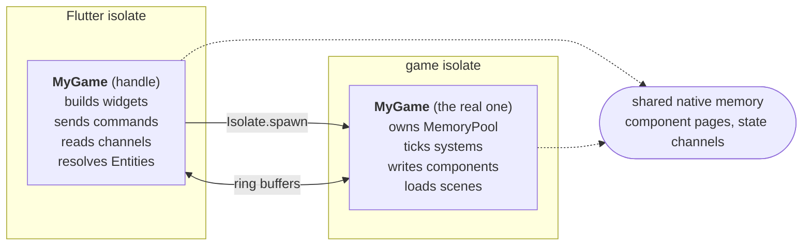
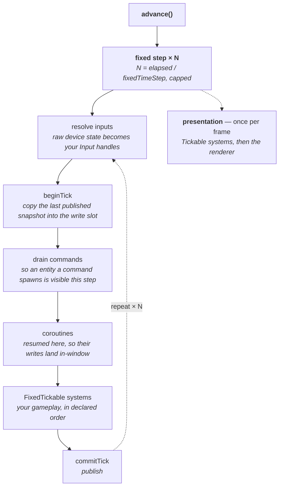

# Architecture

!!! abstract "Layer: kernel (`good`)"
    Everything on this page comes from the kernel and applies unchanged under
    any renderer.

good runs your game on **two isolates**. Understanding how they relate is the
one genuinely unusual thing about the engine, and almost every API shape
downstream follows from it.

## Two copies of one object

`Game.start(game)` hands **your `Game` instance itself** to `Isolate.spawn` as
the spawn message. Dart deep-copies a plain object graph across that boundary,
so what runs on the game isolate is a *second* instance of your class — same
type, same overrides, different identity, different heap.



From that moment the two copies do completely different jobs.

**The game-isolate copy is the real one.** Its `GameState` owns the
`MemoryPool`, the live scenes and the fixed-tick loop, and it is the only
writer of component data and state channels anywhere in the process.

**The main-isolate copy is an inert handle.** Its systems never tick. It exists
to send and handle commands, receive tick notifications and state-channel
updates, build widgets, and **resolve `Entity` handles for reading** — it
re-runs the same declarations, so it has the identical archetype layout and can
read the game isolate's published snapshot straight out of shared memory with
no copying.

!!! danger "Calling a gameplay method on the handle copy does nothing"
    The `game` you still hold after `await Game.start(game)` is the handle. It
    does not reach the simulation. Anything that must cross goes through one of
    the channels below.

### How both copies agree without negotiating

Both copies run `createState()`, `describeScenes`, `describeCommands` and the
rest, in the same order. That is how the two sides agree on every id
**without negotiating one**:

- archetype ids are assigned in first-registration order, so the same code
  registering the same prefabs in the same order assigns the same ids on both
  sides;
- a command's index is its position in the declaration pass;
- a state channel's identity is its index in that one pass.

This is why declaration passes must be **pure and order-stable**. A pass that
branches on `Platform.isWindows`, or registers in a `Set`'s iteration order,
breaks the agreement and produces entity handles that resolve to the wrong
archetype on one side.

## The four lanes across the boundary

Traffic is split by volume and shape, and each lane exists because the others
handle its case badly.

| Lane | Direction | Volume | Use it for |
|---|---|---|---|
| **Component data** | game writes, both read | per-entity | The world itself. Read from Flutter via `Entity` |
| **Commands** | both ways | bulk, per-tick | "Do this": spawn, damage, save. [Ring buffers](flutter-bridge.md#commands) |
| **State channels** | game → main | one small value | HUD numbers: score, health, timings |
| **Control messages** | both ways | rare | Boot, shutdown, enabling systems, asset decode requests |

There is **no second event lane for the main isolate**. Every event in the
engine happens on the game isolate. `Game.buildView` is Flutter's whole surface,
and traffic the other way goes through a command or a state channel.

!!! info "Isolate affinity is a type"
    `GameListener` means "lives on the game isolate" — `GameState`,
    `SceneStruct`, `EntityStruct`, `GameSystem` are all one. `Game` is
    not, so:

    <!-- snippet: skip shows what does not compile, and says so -->
    ```dart
    class MyGame extends Game with FixedTickable { }   // compile error
    ```

    fails to compile instead of silently never ticking. Put the tick on the
    `GameState`, a scene, or a system. Those four types are also the only ones
    that can declare an event — see [Events and listeners](events.md).

## The fixed tick

The simulation advances in **whole steps of `fixedTimeStep`** (16667 µs — 60 Hz
— by default). Wall-clock time accumulates and is spent in whole multiples, so
systems always see exactly that much elapsed time, never a variable frame delta.

```dart
class MyGame extends Game2D {
  @override
  Duration get fixedTimeStep => const Duration(microseconds: 8333);  // 120 Hz

  @override
  int get maxFixedStepsPerAdvance => 5;
}
```

`maxFixedStepsPerAdvance` is the spiral-of-death guard: a machine that cannot
simulate a step in less than `fixedTimeStep` would otherwise fall further behind
every frame. Dropping time is the only stable answer — the simulation runs
slower than wall clock instead of locking up.

### Phases within one advance



Inputs, commands and coroutines all land before the first system runs, so every
system in a step sees one settled picture: the same input snapshot, the same
newly-spawned entities, the same coroutine writes. Presentation runs once per
`advance` however many steps it just ran, including zero.

Two consequences worth internalising:

**Component writes must land inside the tick window.** `beginTick` copies the
last published snapshot over the write slot, so anything written outside the
window is silently discarded. This is why coroutines are `sync*` generators
instead of `async*` — an `async*` body resumes on a microtask, after
`commitTick`, and every write after the first `yield` would be thrown away.

**A read sees the last published snapshot.** If you must read a value after
writing it, the answer is not a second read path — it is to move the reader to a
later phase. `WorldTransformSystem` writes during the fixed tick and its
consumers run after it commits.

## Storage: pages and triple buffers

Component data lives in a `MemoryPool` of native pages, one pool per `Game`.
Each page is a **lock-free round-robin triple buffer**: one slot being written,
one published, one in reserve. That is what lets the Flutter isolate read a
coherent snapshot while the game isolate writes the next one, with no lock and
no copy.

```dart
class MyGame extends Game2D {
  @override
  int get pageSize => 1 << 20;   // 1 MiB — costs 3 MiB resident (three slots)

  @override
  int get maxPages => 128;       // exhausting it throws rather than growing
}
```

The 64 MiB default is generous for a real game and wasteful for a test or a
small scene; override it down freely.

## Inline mode

`Game.startInline(game)` runs the simulation on the **calling isolate** with no
spawn and no ring buffers. It exists for tests and headless tools, where a
second isolate makes assertions awkward and buys nothing:

```dart
final game = await Game.startInline(MyGame());   // autoTick: false by default
game.runFixedStep();                             // drive it yourself
```

`game.state` and `game.runFixedStep()` are available only on an inline run; on a
spawned run they throw, because there is no local state to reach.

`Game.start` also boots inline automatically on the web (`kIsWeb`), since there
is no isolate to spawn there — but the web is not otherwise a supported target.

## Reading the world from Flutter

Because the handle copy shares the archetype layout and adopts each page, an
`Entity` obtained on the Flutter side resolves and reads directly:

```dart
// `playerEntity` is an Entity the game isolate sent over, e.g. as the result
// of a SupplierCommand, or one main resolved itself.
final transform = playerEntity.get<Transform2D>();
final x = transform.transformOffsetX[playerEntity];   // published snapshot
```

This is a read of shared memory, not a message. It is coherent per tick and it
is **read-only** — the game isolate is the only writer, and writing from main is
a bug the assert layer will catch in debug.

---

## Next

[Entities and components →](entities-and-components.md)
