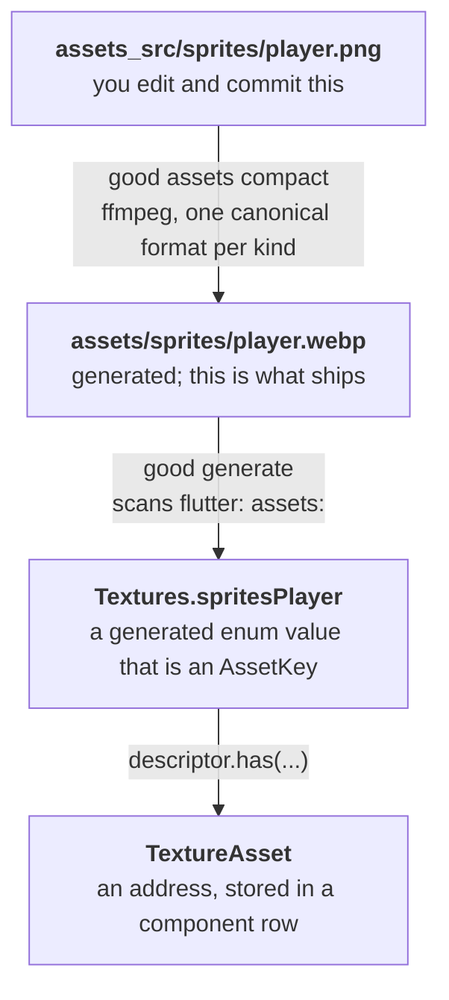

# Assets

<!-- snippet-scope
class Level1 extends SceneStruct {}

class AssetGame extends Game2D {
  late final Level1 level1;
}

Future<void> ensureGameReady() async {}

late MyGame _game;
-->

!!! abstract "Layer: the registry is kernel; `Texture`/`AudioClip` are `goo2d`"

An asset in good is **declared, not loaded**. You name it, the engine resolves it
when the scene that needs it loads, and what you hold is an address — never a
path string and never a `Future` you have to remember to await.

## The path from a file to a sprite



Full details of the first two steps are in
[The asset pipeline](../exporting/asset-pipeline.md). This page is the runtime
half.

## Declaring

Name the asset in the field that holds it:

```dart
class Player extends EntityStruct
    with Transform2D, WorldTransform2D, Renderable2D {
  final texture = Asset.of(Textures.spritesPlayer);
}
```

`Asset.of` reads the descriptor a scene's bring-up opens, and the scene
registers the asset there and then. A prefab that needs a constructor argument
to decide what to declare puts the call in the initializer list, where the
argument is in scope:

```dart
class Prop extends EntityStruct with Transform2D, Renderable2D {
  Prop(TextureKey skin) : texture = Asset.of(skin);

  final TextureAsset texture;
}
```

A prefab built that way has to be built by the scene — `descriptor.has(() =>
Prop(Textures.crate))` — because the window is open only for the duration of
that call. Handing back a prefab built earlier throws.

**Prefabs share their scene's descriptor.** `Asset.of` is idempotent per
identity, so declaring the same texture in a prefab and in its scene produces
the identical handle — one address, one decode. That is what makes naming a
shared texture in three prefabs cost one decode rather than three.

!!! note "A scene declares assets in a hook, not in a field"
    A `SceneStruct` has no `Assets` until `initializeScene`, which runs after
    the constructor returns. So a scene's own field initialiser throws and a
    scene uses `describeAssets`, which is handed the same descriptor `Asset.of`
    reads. A prefab is constructed by the scene's pass, so its fields are
    inside the window. `Event.of` is not in this bucket: the event binder *is*
    open around a declared scene's construction, so a scene's own events go on
    fields.

    A `late final` throws too: it would run on first read, long after the pass
    that both isolate copies replay in the same order, so the asset would be
    addressed on whichever copy happened to touch it first.

!!! danger "Declare it wherever you read it"
    A prefab that uses a texture must declare it, even if its scene already
    does. The scene declaring it does not fill *your* field, and a field read
    in `describeSprites` that nothing assigned is a `LateInitializationError`
    on mount. Declaring in both places costs nothing.

## The generated enums

`good generate` writes one enum value per shipped file:

```dart title="my_game_bundle/lib/textures.dart"
enum Textures with LocalEnumAssetKey<Texture> {
  spritesPlayer('assets/sprites/player.webp'),
  uiButton('assets/ui/button.webp');

  const Textures(this.path);

  @override
  final String path;
}
```

!!! warning "Every subdirectory needs a line of its own"
    `flutter: assets:` entries are not recursive. `- assets/` bundles the files
    sitting directly in `assets/` and nothing below it, so the two values above
    need three entries between them:

    ```yaml
    flutter:
      assets:
        - assets/
        - assets/sprites/
        - assets/ui/
        - assets/packed/
    ```

    Leave one out and Flutter ships nothing from that directory. `good
    generate` stops the build and names the line to add.

An enum, not a list of static keys, because `LocalEnumAssetKey` makes an
enum value **be** an `AssetKey` — `Textures.spritesPlayer` is already the
identity `descriptor.has` wants, with no lookup and nothing to keep in sync. It
also gives the set a `.values`, which is what lets the startup check walk every
asset the game ships.

The path becomes the identifier, so renaming a file renames the enum value and a
stale reference is a **compile error**, not a missing texture at run
time.

`Audios` is identical in shape. That uniformity is the point: a new asset kind
costs a payload type, a loader, and one more call to the same emitter.

!!! info "A project with no assets still compiles"
    Dart has no empty enum, so a project that declares nothing yet gets an
    `abstract final class` with an empty `values` instead. It becomes the enum
    the moment an asset is declared.

## Loading

You never call a loader. `loadScene` resolves everything the scene and its
prefabs declared, and completes when they are ready:

<!-- snippet: body GameState2D<AssetGame> -->
```dart
await loadScene(game.level1);   // assets are resident when this returns
```

Decoding happens **on the Flutter isolate** — the game isolate declares assets
but cannot decode them, so it asks and waits. Assets already resident from
another loaded scene are not decoded twice, and unloading a scene releases only
what nothing else still declares.

## The startup check

`good generate` also writes a readiness check, and calling it before starting the
game is the single best-value line in `main.dart`:

<!-- snippet: plain -->
```dart
await ensureGameReady();
final game = await Game.start(MyGame.new);      // (1)!
```

1. Keep the future this returns, not just the game — see
   [Lifecycle in a widget](flutter-bridge.md#lifecycle-in-a-widget) for why
   that matters when the widget can be disposed mid-start.

It walks every declared asset and asks whether it will be there — **without
loading anything**. `AssetSource.check` consults the manifest and at most stats
a file, never a decode, so it is cheap enough to run over a whole game at
startup. A missing asset found here is a clear message before the first frame;
the same asset found later is a failure in the middle of play, with a scene
half-loaded.

It also installs the asset pack when one exists, which is what makes a packed
release build find its chunks.

<!-- snippet: skip two signatures, not calls -->
```dart
Future<void> ensureGameReady();                      // throws if anything is missing
Future<List<AssetKey<Object?>>> findMissingAssets(); // the list, if you want to show it
```

`AssetAvailability.unverifiable` is **not** counted as a failure. A
loose development build cannot stat a bundle entry and a network source cannot
be checked offline; reporting those as missing would make the check cry wolf
exactly where it is most useful.

## Asset kinds

| Kind | Payload | Loader produces |
|---|---|---|
| Texture | `Texture` | A decoded image ready for the renderer |
| Audio | `AudioClip` | The clip's bytes plus its container format |

### Textures

<!-- snippet-setup
final descriptor = given<SpriteDescriptor>();
late Sprite sprite;
final texture = given<TextureAsset>();
-->
```dart
sprite = descriptor.has(texture: texture, width: 64, height: 64);
```

`TextureFilter` chooses sampling — `mipmap` by default, and the crisp option for
pixel art that must not blur.

### Audio

```dart
class Level1 extends SceneStruct {
  late final AudioAsset music;

  @override
  void describeAssets(AssetDescriptor descriptor) {
    super.describeAssets(descriptor);
    music = descriptor.has(Audios.musicTheme);
  }
}
```

An `AudioClip` carries the file's bytes and the container they are in — Ogg
Vorbis by default, whatever `good assets compact` produced. The format is carried
instead of re-sniffed, because the loader already knows it and a backend would
otherwise have to guess from a header.

## Asset sources

An `AssetSource` answers "where do these bytes come from", and the pipeline
swaps it without any game code changing:

| Source | Used when |
|---|---|
| `BundleSource` | Loose files, resolved through `rootBundle` — the development build |
| Pack chunk | A release build; `AssetPack` maps a logical path to its chunk |
| `MemorySource` | Tests and generated content |

A development build installs no pack, so `BundleSource` resolves a logical path
straight through `rootBundle` — the shortest path from a changed file to seeing
it. A release build installs the pack, and the same logical path resolves into a
compressed, encrypted chunk. **Nothing in your game code differs between the
two.**

## Custom asset types

A new kind is a payload type, an `AssetInfo`, and an `AssetLoader<T>` registered
into `AssetLoaders`. `Texture` and `AudioClip` are both implemented that way,
which is how a renderer registers its own kinds into the same pipeline instead
of needing one of its own.

---

## Next

[Physics →](physics.md)
