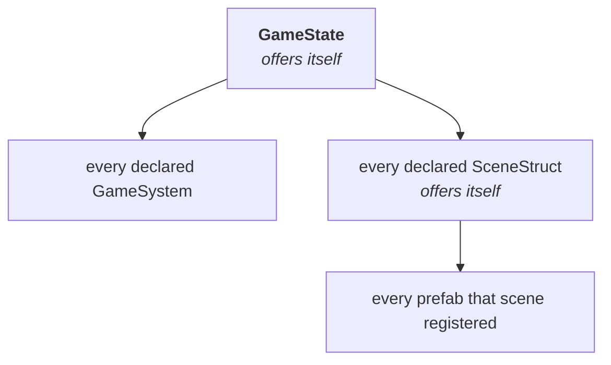

# Events and listeners

<!-- snippet-scope
class ArenaGame extends Game2D {
  @override
  ArenaState createState() => ArenaState();
}

class ArenaState extends GameState2D<ArenaGame> {}

class MusicSystem extends GameSystem {}

late EventDispatcher<EntityLifecycleListener, Entity> mountedEvent;
late EventDispatcher<WaveListener, int> waveCleared;
int wave = 1;
-->

!!! abstract "Layer: kernel (`good`)"

Every callback the engine hands you arrives the same way. The fixed tick, an
entity mounting, a scene loading, the game coming up: all of them are events,
delivered to listener lists the engine resolved once at boot. There is no event
class to write, no emitter to construct, and no `subscribe` call anywhere in
the API. You mix in a listener type and the engine has already worked out that
you are one.

This page is the mechanism, and it is the same mechanism you use for events of
your own.

## A dispatcher is a field

An event is an `EventDispatcher<L, E>` held in a `late final` field. `L` is the
listener type it delivers to; `E` is the payload it carries. You declare it in
`describeEvents`, which runs once, and you fire it by calling it.

This is the declaration behind `onEntityMounted` — `EntityStruct` holds it, and
your prefab receives the event because it mixes in the listener type:

<!-- snippet: in EntityStruct -->
```dart
late final EventDispatcher<EntityLifecycleListener, Entity> mountedEvent;

@override
void describeEvents(EventDescriptor descriptor) {
  super.describeEvents(descriptor);
  mountedEvent = descriptor.has(
    (listener, entity) => listener.onEntityMounted(entity),
  );
}
```

Firing it is one call, and the dispatcher is named `call` so the parentheses
work directly:

```dart
mountedEvent(entity);       // same as mountedEvent.call(entity)
```

The closure handed to `has` is the whole of delivery, and it is built once,
during the declaration pass. Nothing is constructed per dispatch: the payload
travels as an argument, so there is no event object at all and firing an event
allocates nothing whatever the payload is. That matters most for the tick,
which fires sixty times a second forever.

For an event that carries nothing, use `hasSignal` and hold a
`SignalDispatcher<L>`. The fixed tick is the case — it happened, and that is
the entire message:

<!-- snippet-setup
final descriptor = given<EventDescriptor>();
-->
```dart
late final SignalDispatcher<FixedTickable> fixedTickEvent;

fixedTickEvent = descriptor.hasSignal((listener) => listener.onFixedUpdate());
```

Keep the handle the descriptor returns. Nothing is addressable by name, so
there is nothing to look up later — the same shape every other `describe*` pass
uses.

## Who can declare one

Anything that mixes in `EventBus`, whose bound is `on GameListener`. Four
framework types qualify — `GameState`, `SceneStruct`, `EntityStruct` and
`GameSystem` — and they are exactly the four that live on the game isolate.

`Game` is not a `GameListener`, so it cannot declare or receive an event. Every
event in the engine happens on the simulating isolate; traffic to Flutter goes
out through [state channels](flutter-bridge.md#state-channels) and comes back
as [commands](flutter-bridge.md#commands).

These are the built-in dispatchers, with the mixin you apply to hear each one:

| Dispatcher | Declared on | Listener mixin |
|---|---|---|
| `fixedTickEvent` | `GameState` | `FixedTickable` |
| `tickEvent` | `GameState` | `Tickable` |
| `gameMountedEvent`, `gameUnmountedEvent` | `GameState` | `GameLifecycleListener` |
| `entitySpawnedEvent`, `entityDespawnedEvent` | `GameState` | `EntitySpawnListener` |
| `sceneLoadedEvent`, `sceneUnloadedEvent` | `GameState` | `SceneLoadListener` |
| `mountedEvent`, `unmountedEvent` | `SceneStruct` | `SceneLifecycleListener` |
| `mountedEvent`, `unmountedEvent` | `EntityStruct` | `EntityLifecycleListener` |
| `mountEvent`, `unmountEvent` | `GameSystem` | `GameSystemLifecycleListener` |

The pairs are not redundant. `SceneLifecycleListener` on a `SceneStruct` means
"an instance of **me** mounted"; `SceneLoadListener` on a system means "**a**
scene mounted, tell me which". Which one you want depends on whether you are
the thing coming up or an observer watching the world. The entity pair splits
the same way.

## How listeners are collected

Two passes run over each owner at boot, in this order:

1. **`describeEvents`** creates every dispatcher that owner declares.
2. **`collectListeners`** walks that owner's composition and offers each
   candidate to every dispatcher it just created. A dispatcher accepts a
   candidate when it is an `L`, and ignores it otherwise.

After that the lists are settled. Dispatch is then an indexed `for` over a
plain list — no walking, no type tests, no allocation, and no work at all for
an object that could never have received the event.

The default `collectListeners` offers `this`, which is what makes a prefab hear
its own mount. An owner that composes other things overrides it and offers them
too, and those overrides are the whole of how far an event travels:



So **an event reaches its declaring owner's composition and nothing wider.**
Declared on the `GameState` it reaches every system, every scene and every
prefab. Declared on a `SceneStruct` it reaches that scene and the prefabs it
registered. Declared on an `EntityStruct` or a `GameSystem` it reaches that one
object, because a prefab composes nothing further and a system's default walk
offers only itself.

That last line explains something otherwise surprising: a dispatcher you
declare on your own system delivers back to your own system and to nobody else.
Put a game-wide event on the state.

You can widen your own walk by overriding `collectListeners`, calling `super`
first:

<!-- snippet: in GameState -->
```dart
@override
void collectListeners(ListenerCollector collector) {
  super.collectListeners(collector);
  collector.offer(getSystem<MusicSystem>());
}
```

Skipping `super` drops everything the framework was about to offer — every
system and every scene, in the `GameState` case. Offering the same object twice
is harmless: the collector deduplicates by identity, so a listener never
receives one event twice.

!!! info "A disabled system stays in the list"
    `state.disableSystem<AiSystem>()` does not rebuild anything. The system is
    still in every dispatcher that collected it and now answers `false` to
    `listensToEvents`, which every dispatch checks before delivering. One bool
    read per listener buys a membership list that never has to change.

## Ordering

Delivery follows collection order, and collection order is declaration order:
systems in the order `describeSystems` declared them (then `compareTo`), scenes
in `describeScenes` order, prefabs in `describeScene` order. Nothing sorts at
dispatch time.

Bring-up runs outside-in — the owner first, then what it composes — so
`onSceneMounted` on the scene struct itself has already spawned the starting
entities by the time a watching system hears about it.

Teardown has to run the other way. A listener told the world is going away
*after* its owner has already taken it apart is looking at rubble. Pass
`reverse: true` and the dispatcher reads its collected list backwards, which is
one list serving both orders instead of two that could drift apart:

<!-- snippet-setup
final descriptor = given<EventDescriptor>();
late SignalDispatcher<GameSystemLifecycleListener> unmountEvent;
-->
```dart
unmountEvent = descriptor.hasSignal(
  (listener) => listener.onUnmounted(),
  reverse: true,
);
```

That is `GameSystem`'s own teardown signal. `GameState.sceneUnloadedEvent` does
the same with a payload. The rule for your own events: forward for anything
meaning "this now exists", reverse for anything meaning "this is going away".

## Declaring an event of your own

Three pieces. A listener mixin, a dispatcher on the owner whose reach you want,
and a call.

**The listener mixin.** Bound `on GameListener`, with no-op bodies so a
listener overrides only the hooks it cares about:

```dart
mixin WaveListener on GameListener {
  void onWaveCleared(int wave) {}
}
```

The bound is doing real work. `Game` is not a `GameListener`, so
`class MyGame extends Game with WaveListener` fails to compile instead of
compiling cleanly and never firing.

**The dispatcher.** A wave clearing is game-wide, so it goes on the state,
whose walk reaches everything:

```dart
class ArenaState extends GameState2D<ArenaGame> {
  late final EventDispatcher<WaveListener, int> waveCleared;

  int wave = 1;

  @override
  void describeEvents(EventDescriptor descriptor) {
    super.describeEvents(descriptor);
    waveCleared = descriptor.has(
      (listener, wave) => listener.onWaveCleared(wave),
    );
  }

  void clearWave() {
    waveCleared(wave);
    wave++;
  }
}
```

**The listeners.** Anything the state collects opts in by mixing `WaveListener`
in. It needs nothing else — no registration call, no handle to keep:

```dart
class MusicSystem extends GameSystem with WaveListener {
  @override
  void onWaveCleared(int wave) {
    // swap the track
  }
}

class Orc extends EntityStruct with Transform2D, Renderable2D, WaveListener {
  @override
  void onWaveCleared(int wave) {
    // fires once for the prefab, not once per orc
  }
}
```

!!! warning "A prefab is one object, so it hears an event once"
    There is one `Orc` instance in the whole game — see
    [Entities and components](entities-and-components.md#an-entitystruct-is-a-layout-not-an-object).
    A broadcast event calls its handler a single time, with no entity attached,
    even if ten thousand orcs are alive. Work that has to touch every orc
    belongs in a system with a query; the prefab handler is for setting a flag
    that the system then reads.

Carrying more than one value means a record, exactly as
[commands](flutter-bridge.md#more-than-one-parameter-use-a-record) do:

```dart
typedef WaveResult = ({int wave, int survivors});

late final EventDispatcher<WaveListener, WaveResult> waveFinished;

waveFinished((wave: 3, survivors: 12));
```

## When a plain method call is the better answer

A dispatcher earns its keep when an event has to reach a whole composition of
listeners you do not know at declare time — a spatial index, a replication
table, three prefabs and a music system that each want the same news.

For "this system tells that system", write the method call. Both ends live on
the same isolate, `getSystem<T>()` gives you a typed handle, and one direct call
is shorter to read than a mixin, a dispatcher and a declaration pass. Cache the
handle in a field if the call is per-contact or per-entity, because
`getSystem` is a lookup.

And an event a Flutter widget has to show is not an event on this side at all.
Numbers go out through [state channels](flutter-bridge.md#state-channels) and
actions come back as [commands](flutter-bridge.md#commands).

## Two things that look like events and are not

**The physics callbacks.** `CollisionListener` — `onCollisionEnter2D` and its
five siblings — is bound `on Component`, not `on GameListener`, so none of the
machinery on this page touches it. The physics system resolves it at the
contact with `entity.tryGet<CollisionListener>()` and calls your override
directly. Same "no-op defaults, override what you need" shape; different
delivery. See [Physics](physics.md).

**`GameState.onMounted()`.** A plain virtual method. One receiver, the
framework is the only caller, and there is nobody else it could be dispatched
to.

---

## Next

[Input →](input.md)
