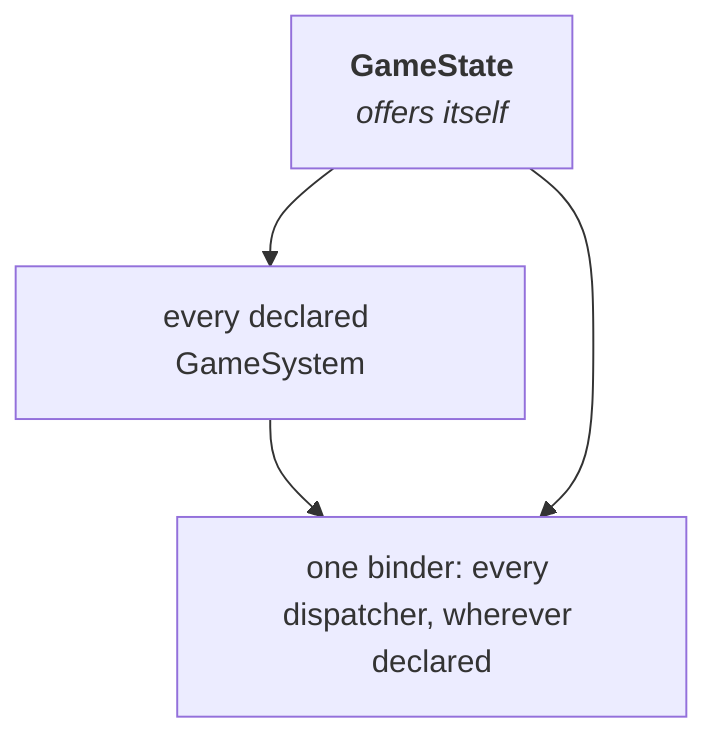

# Events and listeners

<!-- snippet-scope
class ArenaGame extends Game2D {
  @override
  ArenaState createState() => ArenaState();
}

class ArenaState extends GameState2D<ArenaGame> {}

class MusicSystem extends GameSystem {}

late EventDispatcher<EntitySpawnListener, Entity> entitySpawnedEvent;
late EventDispatcher<WaveListener, int> waveCleared;
int wave = 1;

mixin WoundListener on GameListener {
  void onWounded(int damage) {}
}

mixin ChirpListener on GameListener {
  void onChirp() {}
}
-->

!!! abstract "Layer: kernel (`good`)"

Every callback the engine hands you arrives the same way. The fixed tick, an
entity mounting, a scene loading, the game coming up: all of them are events,
delivered to listener lists the engine resolved once at boot. There is no event
class to write, no emitter to construct, and no `subscribe` call anywhere in
the API. You mix in a listener type and the engine has already worked out that
you are one.

This page is the mechanism, and it is the same mechanism you use for events of
your own.

## A dispatcher is a field

An event is an `EventDispatcher<L, E>` held in a field. `L` is the listener
type it delivers to, `E` is the payload it carries, and you fire it by calling
it.

The declaration goes in the field's own initialiser:

<!-- snippet: in GameSystem -->
```dart
final wounded = Event.of<WoundListener, int>(
  (listener, damage) => listener.onWounded(damage),
);
```

Write the type arguments out. `descriptor.has(...)` reads `L` and `E` off the
field it is assigned to; an initialiser has no such context, so the listener
type and the payload type are stated at the call — which is all the separate
`late final EventDispatcher<L, E>` line used to say.

The initialiser is eager, and `late final wounded = Event.of(...)` is the one
way to get this wrong. A `late` initialiser runs on the first *read*, by which
time the collect pass has been and gone: the dispatcher would exist, hold an
empty list, and deliver to nobody, every time. It throws rather than do that
quietly.

Firing it is one call, and the dispatcher is named `call` so the parentheses
work directly:

```dart
entitySpawnedEvent(entity);   // same as entitySpawnedEvent.call(entity)
```

The closure is the whole of delivery, and it is built once, at declaration.
Nothing is constructed per dispatch: the payload travels as an argument, so
there is no event object at all and firing an event allocates nothing whatever
the payload is. That matters most for the tick, which fires sixty times a
second forever.

For an event that carries nothing, use `Event.signal` and hold a
`SignalDispatcher<L>`. The fixed tick is the case — it happened, and that is
the entire message, and `GameState.fixedTickEvent` is this declaration with a
different name on it:

<!-- snippet: in GameSystem -->
```dart
final chirped = Event.signal<ChirpListener>((listener) => listener.onChirp());
```

### The hook

`describeEvents` is the other form. It runs once at boot, is handed a descriptor
to declare into, and exists for a dispatcher whose delivery closure needs
something the field initialiser cannot see:

<!-- snippet: in GameSystem -->
```dart
late final EventDispatcher<WaveListener, int> waveSpotted;

@override
void describeEvents(EventDescriptor descriptor) {
  super.describeEvents(descriptor);
  waveSpotted = descriptor.has(
    (listener, wave) => listener.onWaveCleared(wave),
  );
}
```

`late final` with no initialiser is right here and only here: the field is
assigned from the hook, which runs after the constructor.

An owner may use both forms at once: its fields' dispatchers are declared first,
its hook's second, and one collect pass fills them all.

Keep the handle, whichever way you declared it. Nothing is addressable by name,
so there is nothing to look up later — the same shape every other `describe*`
pass uses.

## Who can declare one

Anything that mixes in `EventBus`, whose bound is `on GameListener`. Two
framework types qualify — `GameState` and `GameSystem` — and they are the two
that carry behaviour on the game isolate.

A `SceneStruct` and an `EntityStruct` are neither. They are declarations of a
scene and of a row layout, they receive no events, and they hear their own
bring-up through `onSceneMounted` and `onEntityMounted`, which the engine calls
on them directly.

`Game` is not a `GameListener` either, so it cannot declare or receive an event.
Every event in the engine happens on the simulating isolate; traffic to Flutter
goes out through [state channels](flutter-bridge.md#state-channels) and comes
back as [commands](flutter-bridge.md#commands).

These are the built-in dispatchers, with the mixin you apply to hear each one:

| Dispatcher | Declared on | Listener mixin |
|---|---|---|
| `fixedTickEvent` | `GameState` | `FixedTickable` |
| `tickEvent` | `GameState` | `Tickable` |
| `gameMountedEvent`, `gameUnmountedEvent` | `GameState` | `GameLifecycleListener` |
| `entitySpawnedEvent`, `entityDespawnedEvent` | `GameState` | `EntitySpawnListener` |
| `sceneLoadedEvent`, `sceneUnloadedEvent` | `GameState` | `SceneLoadListener` |

Three more hooks look like they belong in that table and do not.
`GameSystem.onMounted`, `SceneStruct.onSceneMounted` and
`EntityStruct.onEntityMounted` are methods, not events: one receiver, the
framework the only caller, and the receiver is the thing the call is about.
`SceneLoadListener` on a system is the other question
— "**a** scene mounted, tell me which" — and it is an event because the
audience is open. The entity pair splits the same way.

## How listeners are collected

Two passes run at boot, in this order:

1. **The declaration pass** creates every dispatcher in the game — the state's
   and every system's, field initialisers first and `describeEvents` second.
2. **`collectListeners`** walks the composition once and offers each candidate
   to **every** dispatcher from pass one. A dispatcher accepts a candidate when
   it is an `L`, and ignores it otherwise.

After that the lists are settled. Dispatch is then an indexed `for` over a
plain list — no walking, no type tests, no allocation, and no work at all for
an object that could never have received the event.

There is one binder for the whole game, so **who declared an event decides
nothing about who hears it.** A dispatcher on a system reaches exactly what one
on the state reaches, and that is what lets a package ship an event: it ships a
system holding the dispatcher, and you write one `@system` field.



The default `collectListeners` offers `this`. An owner that composes other
things overrides it and offers them too — which is how the state offers its
systems:

<!-- snippet: in GameState -->
```dart
@override
void collectListeners(ListenerCollector collector) {
  super.collectListeners(collector);
  collector.offer(getSystem<MusicSystem>());
}
```

Skipping `super` drops everything the framework was about to offer — every
system, in the `GameState` case. Offering the same object twice is harmless: the
collector deduplicates by identity, so a listener never receives one event
twice.

!!! info "A disabled system stays in the list"
    `state.disableSystem<AiSystem>()` does not rebuild anything. The system is
    still in every dispatcher that collected it and now answers `false` to
    `listensToEvents`, which every dispatch checks before delivering. One bool
    read per listener buys a membership list that never has to change.

## Ordering

Delivery follows collection order, and collection order is declaration order:
the state, then its systems in the order their `@system` fields declared them
(then `compareTo`). Nothing sorts at dispatch time.

Bring-up runs outside-in — the thing coming up first, then the observers — so
`onSceneMounted` on the scene struct itself has already spawned the starting
entities by the time a watching system hears `onSceneLoaded`.

Teardown has to run the other way. A listener told the world is going away
*after* its owner has already taken it apart is looking at rubble. Pass
`reverse: true` and the dispatcher reads its collected list backwards, which is
one list serving both orders instead of two that could drift apart:

<!-- snippet-setup
final descriptor = given<EventDescriptor>();
late SignalDispatcher<GameLifecycleListener> shutdown;
-->
```dart
shutdown = descriptor.hasSignal(
  (listener) => listener.onGameUnmounted(),
  reverse: true,
);
```

On a field it is the same argument in the same place —
`Event.signal(..., reverse: true)`, which is how
`GameState.sceneUnloadedEvent` does it with a payload. The rule for your own
events: forward for anything meaning "this now exists", reverse for anything
meaning "this is going away".

## Declaring an event of your own

Three pieces. A listener mixin, a dispatcher on your state or on a system, and
a call.

**The listener mixin.** Bound `on GameListener`, with no-op bodies so a
listener overrides only the hooks it cares about:

```dart
mixin WaveListener on GameListener {
  void onWaveCleared(int wave) {}
}
```

The bound is doing real work. `Game` is not a `GameListener`, so
`class MyGame extends Game with WaveListener` fails to compile instead of
compiling cleanly and never firing.

**The dispatcher.** On the state here, because the arena owns the wave counter.
On a system it would reach the same listeners:

```dart
class ArenaState extends GameState2D<ArenaGame> {
  final waveCleared = Event.of<WaveListener, int>(
    (listener, wave) => listener.onWaveCleared(wave),
  );

  int wave = 1;

  void clearWave() {
    waveCleared(wave);
    wave++;
  }
}
```

**The listeners.** Any system, and the state itself, opts in by mixing
`WaveListener` in. It needs nothing else — no registration call, no handle to
keep:

```dart
class MusicSystem extends GameSystem with WaveListener {
  @override
  void onWaveCleared(int wave) {
    // swap the track
  }
}

class SpawnSystem extends GameSystem with WaveListener {
  @override
  void onWaveCleared(int wave) {
    // queue the next wave's spawns
  }
}
```

!!! warning "A prefab cannot be a listener"
    `class Orc extends EntityStruct with WaveListener` does not compile, and
    that is the point: there is one `Orc` instance in the whole game — see
    [Entities and components](entities-and-components.md#an-entitystruct-is-a-layout-not-an-object)
    — so a handler on it would run once, with no entity attached, however many
    orcs were alive. Work that has to touch every orc belongs in a system with
    a query.

Carrying more than one value means a record, exactly as
[commands](flutter-bridge.md#more-than-one-parameter-use-a-record) do:

```dart
typedef WaveResult = ({int wave, int survivors});

final waveFinished = Event.of<WaveListener, WaveResult>(
  (listener, result) => listener.onWaveCleared(result.wave),
);

waveFinished((wave: 3, survivors: 12));
```

## When a plain method call is the better answer

A dispatcher earns its keep when an event has to reach a whole composition of
listeners you do not know at declare time — a spatial index, a replication
table, three prefabs and a music system that each want the same news.

For "this system tells that system", write the method call. Both ends live on
the same isolate, `getSystem<T>()` gives you a typed handle, and one direct call
is shorter to read than a mixin, a dispatcher and a declaration pass. Cache the
handle in a field if the call is per-contact or per-entity, because
`getSystem` is a lookup.

And an event a Flutter widget has to show is not an event on this side at all.
Numbers go out through [state channels](flutter-bridge.md#state-channels) and
actions come back as [commands](flutter-bridge.md#commands).

## Two things that look like events and are not

**The physics callbacks.** `CollisionListener` — `onCollisionEnter2D` and its
five siblings — is bound `on Component`, not `on GameListener`, so none of the
machinery on this page touches it. The physics system resolves it at the
contact with `entity<CollisionListener>().component`, on the entities that
have one, and calls your override directly. Same "no-op defaults, override what you need" shape; different
delivery. See [Physics](physics.md).

**`GameState.onMounted()`.** A plain virtual method. One receiver, the
framework is the only caller, and there is nobody else it could be dispatched
to.

---

## Next

[Input →](input.md)
