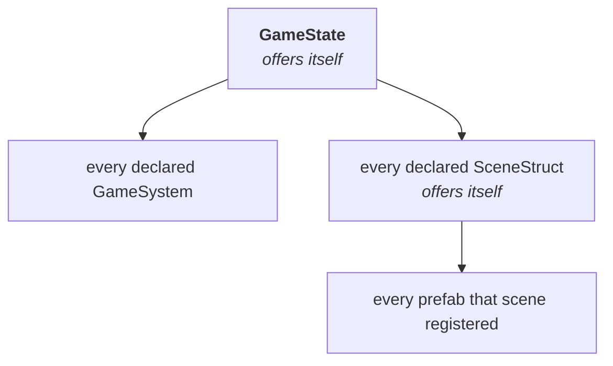

# Events and listeners

<!-- snippet-scope
class ArenaGame extends Game2D {
  @override
  ArenaState createState() => ArenaState();
}

class ArenaState extends GameState2D<ArenaGame> {}

class MusicSystem extends GameSystem {}

late EventDispatcher<EntityLifecycleListener, Entity> mountedEvent;
late EventDispatcher<WaveListener, int> waveCleared;
int wave = 1;

mixin WoundListener on GameListener {
  void onWounded(int damage) {}
}

mixin ChirpListener on GameListener {
  void onChirp() {}
}
-->

!!! abstract "Layer: kernel (`good`)"

Every callback the engine hands you arrives the same way. The fixed tick, an
entity mounting, a scene loading, the game coming up: all of them are events,
delivered to listener lists the engine resolved once at boot. There is no event
class to write, no emitter to construct, and no `subscribe` call anywhere in
the API. You mix in a listener type and the engine has already worked out that
you are one.

This page is the mechanism, and it is the same mechanism you use for events of
your own.

## A dispatcher is a field

An event is an `EventDispatcher<L, E>` held in a field. `L` is the listener
type it delivers to, `E` is the payload it carries, and you fire it by calling
it.

On a `GameState` or an `EntityStruct` the declaration goes in the field's own
initialiser. Both are built by the framework — `Game.createState` for one,
`descriptor.has(Orc.new)` for the other — so there is a constructor call for
the declaration to happen inside:

<!-- snippet: in EntityStruct -->
```dart
final wounded = Event.of<WoundListener, int>(
  (listener, damage) => listener.onWounded(damage),
);
```

Write the type arguments out. An initialiser has no assignment context to read
`L` and `E` from, so the listener type and the payload type are stated at the
call.

The initialiser is eager, and `late final wounded = Event.of(...)` is the one
way to get this wrong. A `late` initialiser runs on the first *read*, by which
time the collect pass has been and gone: the dispatcher would exist, hold an
empty list, and deliver to nobody, every time. It throws rather than do that
quietly.

Firing it is one call, and the dispatcher is named `call` so the parentheses
work directly:

```dart
mountedEvent(entity);       // same as mountedEvent.call(entity)
```

The closure is the whole of delivery, and it is built once, at declaration.
Nothing is constructed per dispatch: the payload travels as an argument, so
there is no event object at all and firing an event allocates nothing whatever
the payload is. That matters most for the tick, which fires sixty times a
second forever.

For an event that carries nothing, use `Event.signal` and hold a
`SignalDispatcher<L>`. The fixed tick is the case — it happened, and that is
the entire message, and `GameState.fixedTickEvent` is this declaration with a
different name on it:

<!-- snippet: in EntityStruct -->
```dart
final chirped = Event.signal<ChirpListener>((listener) => listener.onChirp());
```

### When there is no window: declare from the constructor body

A `SceneStruct` is constructed by you, not by the framework — `final level =
MainScene();` — so nothing is open while its fields initialise and `Event.of`
in one throws. A constructor body has `this`, and `EventBus.events` is the
owner's own registrar, so that is where a scene declares:

<!-- snippet: top -->
```dart
class MainScene extends SceneStruct {
  late final EventDispatcher<WaveListener, int> waveSpotted;

  MainScene() {
    waveSpotted = events.has(
      (listener, wave) => listener.onWaveCleared(wave),
    );
  }
}
```

`late final` with no initialiser is right here and only here: the field is
assigned from the constructor body, after the initialisers have run.

The three pairs the framework declares for you — `SceneStruct`'s and
`EntityStruct`'s `mountedEvent`/`unmountedEvent`, and `GameSystem`'s
`mountEvent`/`unmountEvent` — are fields with their own initialisers, and they
work however the subclass was built. They go through an internal route that
reads no window: the declaration is recorded, and the object takes it once its
construction finishes. A pair you declare on your own struct or your own system
uses `Event.of` on a field, as long as you let the framework build it.

`SceneDescriptor.has` and `SystemDescriptor.has` both take a `T Function()`,
and a closure may hand back an object that already existed:

<!-- snippet: skip the wrong half of a before/after, and deliberately so -->
```dart
final _spawner = Spawner();                 // built here, in a state field
// ...
descriptor.has(() => _spawner);             // handed over, not built
```

`Spawner` was constructed while the state's own window was open, so an
`Event.of` on one of its fields declared into the state. A dispatcher created
there reaches the state's entire composition — every sibling system, every
scene, every prefab. The engine refuses that at boot and names the class.
Build inside the closure, or pass the constructor:

<!-- snippet: skip two fragments of one class body, not a class -->
```dart
late final Spawner spawner;
// ...
spawner = descriptor.has(Spawner.new);
```

A prefab a fixture built with nothing open above it is fine to hand over:
`Event.*` throws on an empty stack, so it declared nothing anywhere else, and
its base pair landed on the prefab as it always does.

An owner may use both forms at once: its fields' dispatchers and its
constructor body's end up in one binder, and one collect pass fills them all.

Keep the handle, whichever way you declared it. Nothing is addressable by name,
so there is nothing to look up later.

## Who can declare one

Anything that mixes in `EventBus`, whose bound is `on GameListener`. Four
framework types qualify — `GameState`, `SceneStruct`, `EntityStruct` and
`GameSystem` — and they are exactly the four that live on the game isolate.
`GameState`, `EntityStruct` and `GameSystem` declare on a field; a
`SceneStruct` declares its own events from its constructor body, for the
construction reason above.

`Game` is not a `GameListener`, so it cannot declare or receive an event. Every
event in the engine happens on the simulating isolate; traffic to Flutter goes
out through [state channels](flutter-bridge.md#state-channels) and comes back
as [commands](flutter-bridge.md#commands).

These are the built-in dispatchers, with the mixin you apply to hear each one:

| Dispatcher | Declared on | Listener mixin |
|---|---|---|
| `fixedTickEvent` | `GameState` | `FixedTickable` |
| `tickEvent` | `GameState` | `Tickable` |
| `gameMountedEvent`, `gameUnmountedEvent` | `GameState` | `GameLifecycleListener` |
| `entitySpawnedEvent`, `entityDespawnedEvent` | `GameState` | `EntitySpawnListener` |
| `sceneLoadedEvent`, `sceneUnloadedEvent` | `GameState` | `SceneLoadListener` |
| `mountedEvent`, `unmountedEvent` | `SceneStruct` | `SceneLifecycleListener` |
| `mountedEvent`, `unmountedEvent` | `EntityStruct` | `EntityLifecycleListener` |
| `mountEvent`, `unmountEvent` | `GameSystem` | `GameSystemLifecycleListener` |

The pairs are not redundant. `SceneLifecycleListener` on a `SceneStruct` means
"an instance of **me** mounted"; `SceneLoadListener` on a system means "**a**
scene mounted, tell me which". Which one you want depends on whether you are
the thing coming up or an observer watching the world. The entity pair splits
the same way.

## How listeners are collected

Two passes run over each owner, in this order:

1. **The declaration pass** runs while the owner is constructed — the
   dispatchers in its field initialisers, then the ones its constructor body
   declares.
2. **`collectListeners`** runs at boot. It walks that owner's composition and
   offers each candidate to every dispatcher. A dispatcher accepts a candidate
   when it is an `L`, and ignores it otherwise.

After that the lists are settled. Dispatch is then an indexed `for` over a
plain list — no walking, no type tests, no allocation, and no work at all for
an object that could never have received the event.

The default `collectListeners` offers `this`, which is what makes a prefab hear
its own mount. An owner that composes other things overrides it and offers them
too, and those overrides are the whole of how far an event travels:



So **an event reaches its declaring owner's composition and nothing wider.**
Declared on the `GameState` it reaches every system, every scene and every
prefab. Declared on a `SceneStruct` it reaches that scene and the prefabs it
registered. Declared on an `EntityStruct` or a `GameSystem` it reaches that one
object, because a prefab composes nothing further and a system's default walk
offers only itself.

That last line explains something otherwise surprising: a dispatcher you
declare on your own system delivers back to your own system and to nobody else.
Put a game-wide event on the state.

You can widen your own walk by overriding `collectListeners`, calling `super`
first:

<!-- snippet: in GameState -->
```dart
@override
void collectListeners(ListenerCollector collector) {
  super.collectListeners(collector);
  collector.offer(getSystem<MusicSystem>());
}
```

Skipping `super` drops everything the framework was about to offer — every
system and every scene, in the `GameState` case. Offering the same object twice
is harmless: the collector deduplicates by identity, so a listener never
receives one event twice.

!!! info "A disabled system stays in the list"
    `state.disableSystem<AiSystem>()` does not rebuild anything. The system is
    still in every dispatcher that collected it and now answers `false` to
    `listensToEvents`, which every dispatch checks before delivering. One bool
    read per listener buys a membership list that never has to change.

## Ordering

Delivery follows collection order, and collection order is declaration order:
systems in the order `describeSystems` declared them (then `compareTo`), scenes
in `describeScenes` order, prefabs in `describeScene` order. Nothing sorts at
dispatch time.

Bring-up runs outside-in — the owner first, then what it composes — so
`onSceneMounted` on the scene struct itself has already spawned the starting
entities by the time a watching system hears about it.

Teardown has to run the other way. A listener told the world is going away
*after* its owner has already taken it apart is looking at rubble. Pass
`reverse: true` and the dispatcher reads its collected list backwards, which is
one list serving both orders instead of two that could drift apart:

<!-- snippet: in EntityStruct -->
```dart
final wilted = Event.signal<ChirpListener>(
  (listener) => listener.onChirp(),
  reverse: true,
);
```

`GameSystem`'s own `unmountEvent` carries the same flag, and so do
`SceneStruct.unmountedEvent` and `GameState.sceneUnloadedEvent`. The rule for
your own events: forward for anything meaning "this now exists", reverse for
anything meaning "this is going away".

## Declaring an event of your own

Three pieces. A listener mixin, a dispatcher on the owner whose reach you want,
and a call.

**The listener mixin.** Bound `on GameListener`, with no-op bodies so a
listener overrides only the hooks it cares about:

```dart
mixin WaveListener on GameListener {
  void onWaveCleared(int wave) {}
}
```

The bound is doing real work. `Game` is not a `GameListener`, so
`class MyGame extends Game with WaveListener` fails to compile instead of
compiling cleanly and never firing.

**The dispatcher.** A wave clearing is game-wide, so it goes on the state,
whose walk reaches everything:

```dart
class ArenaState extends GameState2D<ArenaGame> {
  final waveCleared = Event.of<WaveListener, int>(
    (listener, wave) => listener.onWaveCleared(wave),
  );

  int wave = 1;

  void clearWave() {
    waveCleared(wave);
    wave++;
  }
}
```

**The listeners.** Anything the state collects opts in by mixing `WaveListener`
in. It needs nothing else — no registration call, no handle to keep:

```dart
class MusicSystem extends GameSystem with WaveListener {
  @override
  void onWaveCleared(int wave) {
    // swap the track
  }
}

class Orc extends EntityStruct with Transform2D, Renderable2D, WaveListener {
  @override
  void onWaveCleared(int wave) {
    // fires once for the prefab, not once per orc
  }
}
```

!!! warning "A prefab is one object, so it hears an event once"
    There is one `Orc` instance in the whole game — see
    [Entities and components](entities-and-components.md#an-entitystruct-is-a-layout-not-an-object).
    A broadcast event calls its handler a single time, with no entity attached,
    even if ten thousand orcs are alive. Work that has to touch every orc
    belongs in a system with a query; the prefab handler is for setting a flag
    that the system then reads.

Carrying more than one value means a record, exactly as
[commands](flutter-bridge.md#more-than-one-parameter-use-a-record) do:

```dart
typedef WaveResult = ({int wave, int survivors});

final waveFinished = Event.of<WaveListener, WaveResult>(
  (listener, result) => listener.onWaveCleared(result.wave),
);

waveFinished((wave: 3, survivors: 12));
```

## When a plain method call is the better answer

A dispatcher earns its keep when an event has to reach a whole composition of
listeners you do not know at declare time — a spatial index, a replication
table, three prefabs and a music system that each want the same news.

For "this system tells that system", write the method call. Both ends live on
the same isolate, `getSystem<T>()` gives you a typed handle, and one direct call
is shorter to read than a mixin, a dispatcher and a declaration pass. Cache the
handle in a field if the call is per-contact or per-entity, because
`getSystem` is a lookup.

And an event a Flutter widget has to show is not an event on this side at all.
Numbers go out through [state channels](flutter-bridge.md#state-channels) and
actions come back as [commands](flutter-bridge.md#commands).

## Two things that look like events and are not

**The physics callbacks.** `CollisionListener` — `onCollisionEnter2D` and its
five siblings — is bound `on Component`, not `on GameListener`, so none of the
machinery on this page touches it. The physics system resolves it at the
contact with `entity<CollisionListener>().component`, on the entities that
have one, and calls your override directly. Same "no-op defaults, override what you need" shape; different
delivery. See [Physics](physics.md).

**`GameState.onMounted()`.** A plain virtual method. One receiver, the
framework is the only caller, and there is nobody else it could be dispatched
to.

---

## Next

[Input →](input.md)
