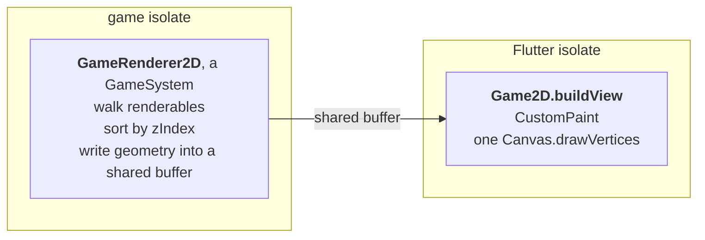

# Rendering and cameras

<!-- snippet-scope
late Sprite sprite;
late TextureKey fontKey;
late Query players;
late Eye eye;
late BoxBody box;
late MyGame game;
double localX = 0, localY = 0, entityWorldX = 0;
double targetX = 0, targetY = 0;
-->

!!! abstract "Layer: 2D (`goo2d`)"
    Everything on this page is `goo2d`'s. `goo3d` supplies its own equivalent,
    and the kernel underneath is the same either way.

## How a frame happens

Rendering is two halves on two isolates, and the split is what keeps the Flutter
side cheap:



`GameRenderer2D` composes world transforms and writes vertex data into a shared
native buffer. The Flutter side replays it as a **single `drawVertices` call per
frame** — no `save`, `restore`, `rotate`, `translate` or `drawImage` anywhere in
the replay path. The view is push-driven off tick notifications instead of
polling vsync.

You declare neither half. `Game2D` and `GameState2D` bring both, which is what
makes `extends Game2D` the whole opt-in for 2D rendering.

## Making something draw

Two mixins and one declaration:

```dart
class Player extends EntityStruct
    with Transform2D, WorldTransform2D, Renderable2D {
  late final Sprite sprite;

  @override
  void describeSprites(SpriteDescriptor descriptor) {
    super.describeSprites(descriptor);
    sprite = descriptor.has(width: 64, height: 64, color: 0xFF4FC3F7);
  }
}
```

`WorldTransform2D` is required — the renderer reads world transforms, not local
ones.

## `Sprite`

Everything `descriptor.has` takes becomes a **column**, so every one of these is
per-entity and writable at run time:

<!-- snippet: skip a signature, not a call -->
```dart
Sprite has({
  TextureAsset? texture,
  TextureFilter filter = TextureFilter.mipmap,
  SpriteFrame frame = SpriteFrame.full,
  int color = 0xFFFFFFFF,
  double width = 0,
  double height = 0,
  int zIndex = 0,
  bool visible = true,
  RelativeOffset2D pivot = RelativeOffset2D.center,
  NineSliceBorder nineSliceBorder = NineSliceBorder.none,
})
```

| Field | Meaning |
|---|---|
| `texture` | The image, or null for a flat colour |
| `color` | ARGB. Multiplied with the texture, so it tints — and is the whole colour when untextured |
| `width`, `height` | Size in world units |
| `zIndex` | Draw order. Higher draws later, on top |
| `visible` | Per-entity on/off, tested before a draw record is ever built |
| `pivot` | Where the sprite's origin sits within itself |
| `frame` | The sub-rectangle of the texture to draw — atlases and sprite sheets |
| `nineSliceBorder` | Stretchable borders for panels and bars |
| `filter` | Sampling: `mipmap`, and the crisp option for pixel art |

The values you pass to `has` are **defaults for every new row**, not fixed
values:

```dart
sprite
  ..color[entity] = 0xFFFF0000
  ..zIndex[entity] = 1000
  ..visible[entity] = false;
```

!!! tip "Hiding is a toggle, not a removal"
    `visible[entity] = false` drops the sprite before it becomes a draw record.
    There is no "remove the renderer component" — see
    [Coming from Unity, Godot or Flutter](mental-model.md).

### Which way a pivot moves the sprite

A pivot's fraction is measured from the texture's top-left, so a `fractionY` of
`0` is the top edge and `1` is the bottom. That is texture space, and texture
space starts at the top in every atlas you are likely to import.

The world it draws into is y-up. The two meet in one fact worth stating
plainly: **moving the pivot down the texture lifts the sprite up in the
world.** The pivot is the point the transform origin sits on, so pushing it
toward the bottom of the image leaves more of the image above the origin.

```dart
sprite.setPivot(entity, const RelativeOffset2D(fractionX: 0.5, fractionY: 1));
```

That anchors a character at its feet. `fractionY` of `1` is the bottom edge of
the texture, and the sprite stands above the entity's position.

The offset you add on top runs the same way, and this is the part that decides
where a collider goes. A pivot `offsetY` of `+20` draws the sprite 20 units
higher; a `Collider2D` offset of `+20` puts a body 20 units higher. So a
collider meant to cover an off-centre sprite takes **the same sign** — and the
same number, when the pivot was nudged with an offset instead of a fraction:

```dart
sprite.setPivot(
  entity,
  const RelativeOffset2D(fractionX: 0.5, fractionY: 0.5, offsetY: 20),
);
box.offsetY[entity] = 20; // matches, and +20 is up for both
```

### Several sprites on one entity

`Renderable2D` is a multi-component, so a prefab can declare more than one:

<!-- snippet: in EntityStruct with Renderable2D -->
<!-- snippet-setup
late Sprite body;
late Sprite muzzleFlash;
late TextureAsset bodyTexture;
late TextureAsset flashTexture;
-->
```dart
@override
void describeSprites(SpriteDescriptor descriptor) {
  super.describeSprites(descriptor);
  body = descriptor.has(width: 64, height: 64, texture: bodyTexture);
  muzzleFlash = descriptor.has(width: 32, height: 32, texture: flashTexture,
                               visible: false, zIndex: 10);
}
```

Toggle `muzzleFlash.visible[entity]` for a frame instead of spawning and
destroying an entity.

## Textures

A texture comes from the generated asset enum. Declare the asset, then hand the
handle to the sprite:

```dart
class Player extends EntityStruct
    with Transform2D, WorldTransform2D, Renderable2D {
  late final TextureAsset texture;
  late final Sprite sprite;

  @override
  void describeAssets(AssetDescriptor descriptor) {
    super.describeAssets(descriptor);
    texture = descriptor.has(Textures.spritesPlayer);
  }

  @override
  void describeSprites(SpriteDescriptor descriptor) {
    super.describeSprites(descriptor);
    sprite = descriptor.has(width: 64, height: 64, texture: texture);
  }
}
```

Declare the asset on **whatever uses it**. `has` is idempotent per identity and
prefabs share their scene's descriptor, so declaring the same texture in a
prefab and its scene yields the identical handle — one address, one decode. See
[Assets](assets.md).

### Atlases and sprite sheets

`SpriteFrame` selects a sub-rectangle of the texture, so many sprites can share
one decoded image — one upload, one batch. A frame is stored as **fractions** of
the texture, and the two named constructors do the division for you at declare
time:

```dart
// A uniform sheet: 8 columns x 4 rows, cell 5 (row-major).
const walk0 = SpriteFrame.grid(columns: 8, rows: 4, index: 5);

// A packed atlas: a pixel rectangle on a sheet whose size you know.
const buttonFace = SpriteFrame.pixels(
  x: 128, y: 64, width: 96, height: 32,
  sheetWidth: 512, sheetHeight: 512,
);

// The default: the whole texture.
const whole = SpriteFrame.full;
```

Both are `const`, so a frame table costs nothing at run time:

```dart
class Player extends EntityStruct
    with Transform2D, WorldTransform2D, Renderable2D {
  final animTime = Field.float64();

  late final Sprite sprite;

  static const List<SpriteFrame> walkCycle = <SpriteFrame>[
    SpriteFrame.grid(columns: 8, rows: 4, index: 0),
    SpriteFrame.grid(columns: 8, rows: 4, index: 1),
    SpriteFrame.grid(columns: 8, rows: 4, index: 2),
    SpriteFrame.grid(columns: 8, rows: 4, index: 3),
  ];

  @override
  void describeSprites(SpriteDescriptor descriptor) {
    super.describeSprites(descriptor);
    sprite = descriptor.has(width: 64, height: 64);
  }
}
```

Then advance it per entity from a system. `animTime` is a `Field.float64()`
column on the prefab, and `12` is the frame rate:

```dart
for (final group in players.groups()) {
  final player = group.get<Player>();
  for (final entity in group) {
    final t = player.animTime[entity] + dt;
    player.animTime[entity] = t;
    final step = (t * 12).floor() % Player.walkCycle.length;
    player.sprite.frame[entity] = Player.walkCycle[step];
  }
}
```

`SpriteFrame.grid` is exact whatever the image's pixel size — the constructor
never asks how big the source is, because it does not need to know.

## Text

`Text2D` puts a line of text in the world: a damage number over an enemy, a name
above a character, a price on a sign. It is drawn from a **grid font** you
supply, it sorts with the sprites on the same `zIndex` scale, and the camera
moves and scales it like anything else.

```dart
class DamageNumber extends EntityStruct
    with Transform2D, WorldTransform2D, Text2D {
  late final TextureAsset atlas;

  @override
  int get textCapacity => 8;

  @override
  void describeAssets(AssetDescriptor descriptor) {
    super.describeAssets(descriptor);
    atlas = descriptor.has(fontKey);
  }

  @override
  BitmapFont get textFont =>
      BitmapFont(texture: atlas, columns: 16, rows: 6, glyphCount: 95);

  @override
  void describeStruct(DataDescriptor data) {
    super.describeStruct(data);
    textCellWidth.defaultValue = 8;
    textCellHeight.defaultValue = 12;
  }
}
```

Then write the text per entity:

```dart
entity<Text2D>().setText('Boss');
entity<Text2D>().setInt(-24);
final showing = entity<Text2D>().text;
```

`setInt` builds no `String`, so a number that changes every frame costs no
allocation at all. `setText` allocates nothing either — whatever built the
string did.

### The font is a sprite sheet

A `BitmapFont` is a texture plus three numbers: how many cells across, how many
down, and which code point cell 0 draws. A character's cell is
`codeUnit - firstCodepoint`, split by `columns`, and its rectangle in the atlas
is that cell divided by the grid — no pixel size anywhere, so a repacked atlas
still slices correctly and nothing waits for the image to decode.

`firstCodepoint` is 32 by default, which is where an ASCII sheet normally
starts. `glyphCount` says how many cells actually hold a glyph, for a last row
that is only partly filled. A code unit with no cell draws nothing and still
advances, so a missing character leaves its gap instead of pulling the rest of
the line left.

There is no `flutter: fonts:` entry involved. That mechanism belongs to the
Flutter isolate and the renderer runs on the other one; a bitmap font is an
ordinary texture asset and goes through the same pipeline as every other image.

**The engine ships no font.** Supply your own PNG grid — one texture, one
`TextureKey`, and the three numbers above.

The font belongs to the prefab, not to the row: `textFont` is read once per
archetype, when the archetype is described, and the renderer draws from the
stored answer in `textFontResolved`. Two fonts in one scene are two prefabs.

### Capacity is storage, not a limit you can bend

`textCapacity` reserves that many UTF-16 code units in **every row of the
archetype**, the same way `hasPolygonCollider`'s `maxPoints` does. Pick it for
the longest text that prefab will ever show.

A string that does not fit is a programming error, so a debug run stops on it.
A release build has no assert to stop it: it keeps what fits and adds the rest
to `Text2D.textCodeUnitsDropped`, a running total over every entity of that
prefab. Zero there means no label has ever been cut; anything else is how much
text is missing and by how much the capacity is short.

### The pivot is the alignment

A label's box is as wide as the text currently in it, and the pivot resolves
against that box:

| `textPivotFractionX` | Where the entity sits |
|---|---|
| `0` | at the label's left edge — left-aligned |
| `0.5` (default) | in its middle — centred, however the text changes length |
| `1` | at its right edge |

`textPivotOffsetX`/`textPivotOffsetY` shift it by a fixed number of world units
on top of that. There is no separate alignment enum; this is it.

`textCellWidth` and `textCellHeight` are one glyph's size in world units, and
`textLetterSpacing` adds to the advance without changing the cell — negative to
tighten a grid whose cells carry more side bearing than you want.

### What a label costs

One candidate and **one record per glyph it draws**. `maxSpritesPerTick` counts
records, so a screen of long labels reaches the cap sooner than the entity count
suggests, and a label is admitted all or nothing: one that does not fit closes
the budget for everything behind it. A code unit the font has no cell for is
charged nothing, and an empty label is not a candidate at all.

The row stays small — `textCapacity` code units and about fifty more bytes,
because the font, its metrics and the atlas address are on the component. The
same sixteen glyphs declared as sixteen sprites would be a 2.5 KiB row, which is
ten times the row size that already cost this renderer 42% of its write pass.

### One label per entity, and world space only

`Text2D` is a plain component, so an entity that wants both a name and a damage
number wants two entities. Parent one to the other and it follows.

**There is no screen-space text.** A HUD is Flutter widgets over the `GameView`
— see [Where your UI belongs](flutter-bridge.md#where-your-ui-belongs) — and
that is the first thing to reach for when what you want is a score in the
corner. `Text2D` is for text the world owns, and a prefab mixing it in beside
[`ScreenTransform2D`](#screen-space) trips a debug assert instead of drawing its
label through the camera.

Not built, and named here so you do not go looking: proportional metrics,
kerning, line wrapping, and shaping for scripts that need it. `\n` is not a line
break — it is a code unit like any other, so two lines are two entities.

## Cameras

A camera is an entity: `Transform2D`, `WorldTransform2D` and `Camera`.

```dart
class Eye() extends EntityStruct with Transform2D, WorldTransform2D, Camera;
```

| Column | Meaning |
|---|---|
| `cameraZoom` | Screen pixels per world unit. `1` is 1:1, `2` zooms in, `0.5` out |
| `cameraView` | Which declared `CameraView` this camera fills, or null for none |

<!-- snippet: plain -->
```dart
final camera = scene.addEntity(eye);
eye.cameraView[camera] = game.defaultCamera;
eye.cameraZoom[camera] = 2;
```

`cameraView` is typed, not an integer — a stray int does not compile there.

!!! warning "A camera's rotation is ignored"
    The projection reads the camera's world x, its world y and `cameraZoom`, and
    nothing else. The same scene through a camera at rotation 0 and through
    one at rotation π/2 draws identically, and a camera parented to something
    that turns inherits the turn and still draws upright. A banking view, or
    one locked to a subject's facing, has nothing here to build on
    ([#172](https://github.com/sunarya-thito/good/issues/172)).

### Views

A **view** is a surface a camera can fill. `Game2D` declares one for you:

<!-- snippet: expr -->
```dart
GameView(camera: game.defaultCamera)
```

Declare more when you want split screen, a minimap, or a second window:

```dart
class MyGame extends Game2D {
  late final CameraView minimap;

  @override
  void describeCameras(CameraDescriptor descriptor) {
    super.describeCameras(descriptor);
    minimap = descriptor.has();
  }
}
```

Each view sizes and allocates its own per-view storage, and **each draws the
scene its own camera is in** — so two views can be looking at different scenes
at the same instant.

!!! warning "One camera per view"
    Two cameras pointing at the same view trips a debug assert. A camera
    defines that view's origin, so a second one has no meaning. In release the
    first in query order wins.

    There is no switch that turns a camera off. Setting its `view` to null is
    what takes one out of play.

### No camera at all

A game with no active camera draws at the origin with a zoom of 1, and the whole
world is drawn. A game that has not placed a camera yet shows something, not a
black screen.

`GameView.headless(game: game)` is the other legitimate shape: a HUD-only or
headless-plus-Flutter game, with no camera and nothing painted.

## Screen space

`ScreenTransform2D` places an entity against the **view** instead of against
the world. Mix it in beside `Transform2D` and the same offset columns become
view units measured from an anchor on the view, the camera's zoom stops scaling
it, and the camera's position stops moving it.

```dart
class Backdrop extends EntityStruct
    with Transform2D, ScreenTransform2D, Renderable2D {
  late final Sprite fill;

  @override
  final screenLayer = ScreenLayer.behind;

  @override
  final screenWidthAxis = ScreenAxis.fraction;

  @override
  final screenHeightAxis = ScreenAxis.fraction;

  @override
  void describeSprites(SpriteDescriptor descriptor) {
    super.describeSprites(descriptor);
    fill = descriptor.has(width: 1, height: 1, color: 0xFF203040);
  }
}
```

That draws a rectangle covering the whole viewport, behind everything the world
draws, at whatever size the view happens to be.

### Which mixin decides which space

| mixins | space |
|---|---|
| `Transform2D` | flat world — the offsets are world units, nothing composes them |
| `Transform2D, WorldTransform2D` | composed world — the offsets compose with every ancestor's |
| `Transform2D, ScreenTransform2D` | screen — the offsets are view units from an anchor |

`ScreenTransform2D` and `WorldTransform2D` on one prefab trips a debug assert.
They mean two different things by an offset and there is no composition that
reconciles them: an ancestor's offset is world units, this entity's is view
units, and a parent and a child anchored to two different corners share no
origin to compose through. Group screen-space art with several `Sprite`s on one
entity instead.

A screen-space entity may still be a `Child` — nothing composes it, so it draws
where its own offsets put it and a parent that moves or turns takes it nowhere.

### Where it lands

```text
viewX = anchor.fractionX * viewWidth  + transformOffsetX
viewY = anchor.fractionY * viewHeight - transformOffsetY
```

`ScreenAnchor` names the nine corners, edges and centre of the view. `+y` is up
here as everywhere else, which is where the second minus sign comes from, and
`ScreenAnchor.center` with no offsets is the middle of the view.

The sprite's own `pivot` is a separate thing and keeps its default: anchoring to
`bottomRight` puts the sprite's *centre* on the corner, so half of it is off
screen. Set `pivot: RelativeOffset2D.zero` and the sprite's top-left corner goes
on the anchor instead.

A view nothing has laid out reports a size of zero, so every anchor collapses
onto its top-left corner. That is what a headless test and the first tick of a
real game both see.

### Sizing per axis

`ScreenAxis` says what a `Sprite`'s width and height mean, one axis at a time:

- `units` — a length in view units, the same number at every view size.
- `fraction` — a fraction of the view's own width or height. `1` fills the view
  on that axis, `0.5` covers half of it.

The two axes are independent, so a banner half the view wide and a fixed twenty
units tall is `screenWidthAxis = fraction` with `width: 0.5` and the height left
alone. Aspect-preserving fit is not built — see
[Implementation status](../reference/roadmap.md).

### Nothing per view is in the row

Two views can show one scene at two sizes in the same instant, so there is no
single pixel width to store. Every `ScreenTransform2D` member is an overridable
field on the prefab, read once per archetype per view, and the renderer turns it
into pixels inside its own per-view walk where that view's size is in scope. One
backdrop is correct in a 400-pixel minimap and a 1920-pixel main view at once,
and the row grows by nothing.

The cost is the other half of that: an entity cannot change its anchor, layer or
sizing mode at run time. Offsets, scale, rotation and every `Sprite` field still
move; two anchors means two prefabs.

### Layers, not a large `zIndex`

`ScreenLayer.behind` draws before every world sprite, `ScreenLayer.front` after
every world sprite and every label. Within a layer, `zIndex` orders as usual.

Screen-space entities do not interleave with world sprites by `zIndex`, and the
reason is the sort. `zIndex` is a plain `int32` a game may use as a sparse key,
and the renderer buckets its whole queue over the range between the smallest and
largest z it sees: one HUD element at `1 << 20` pushes every sprite in the frame
onto the fallback merge sort, and a "safe" 60,000 grows the bucket array to
60,001 ints that are never released. A layer costs three comparisons per queued
sprite and a frame with no screen-space entity in it costs two in total.

The budget spends from the front of the scene backwards, so the front layer is
admitted first: a pinned element does not vanish because twenty thousand
particles were queued ahead of it. A backdrop is the first thing a frame over
budget drops.

### What is not here

No parallax, no texture tiling, no `auto`/`cover`/`contain` fit, and no
screen-space text — `Text2D` on a `ScreenTransform2D` entity is refused at
declare time, and not drawn through the camera. See
[Implementation status](../reference/roadmap.md).

## Coordinate conversion

Going between a `GameView` pixel and world space is a first-class operation —
picking, placing UI at a world position, dragging:

```dart
final projection = getSystem<MousePickingSystem>().projection;
final worldX = projection.viewToWorldX(localX);
final worldY = projection.viewToWorldY(localY);
final viewX  = projection.worldToViewX(entityWorldX);
```

`CameraProjection` re-resolves the active camera and the view size each tick, so
it always reflects the current zoom and viewport.

The **y sign flips here and nowhere else**. World +Y is up and a `GameView`
pixel's y grows downward, so these four methods are the whole of the conversion
between the two. Use them rather than `world - cameraOrigin` by hand, or a
tooltip you place at a world position ends up mirrored about the middle of the
view.

A zoom of zero maps the whole world onto one pixel, so the inverse reports the
camera's own origin, not an infinity that would poison every downstream
comparison silently.

## Debug draw

`debugDraw` puts shapes over the world from a system: a line for where an agent
thinks it is heading, a circle for a search radius, a label for the state it is
in. A steering vector is a picture and not a value, so a channel or a log
cannot show it. Reach it from any `GameSystem` or `Component`, the way you
reach `mousePicking`.

```dart
class Navigation extends GameSystem with FixedTickable {
  @override
  void onFixedUpdate() {
    for (final group in players.groups()) {
      final world = group.get<WorldTransform2D>();
      for (final entity in group) {
        debugDraw.line(
          world.worldX[entity],
          world.worldY[entity],
          targetX,
          targetY,
          color: 0xFF00FFFF,
        );
        debugDraw.circle(targetX, targetY, radius: 0.3);
        debugDraw.label(world.worldX[entity], world.worldY[entity], 'seek');
      }
    }
  }
}
```

| Call | Draws | Records |
|---|---|---|
| `line(x0, y0, x1, y1)` | a straight segment between two world points | 1 |
| `circle(x, y, radius: r)` | an outline, as `segments` chords — 24 by default | one per segment |
| `label(x, y, 'text')` | one line of text centred on the point | one per glyph stroke, about four a character |

Colours are packed ARGB integers, as they are on `Sprite.color` and
`Text2D.textColor`. The default is magenta, `0xFFFF00FF`, which no art asset
is.

### World space, pixel ink

Positions are world coordinates and go through the same `CameraProjection` the
sprites go through, so a line lands on the thing it describes at any camera
position and any zoom. `thickness` and a label's `size` are **view pixels** and
do not scale with the camera: a one-world-unit label is four pixels tall on a
zoomed-out map and tells you nothing, while a one-world-unit line is a blob at
4x.

Shapes are drawn after the whole scene, in call order. They do not sort against
sprites on `zIndex` — the overlay is on top of everything, so a sprite cannot
cover the thing you are reading.

### It is compiled out of a release build

`debugDrawEnabled` is a `const bool`: true in a debug build, false in profile so
a profile run measures the game and not the overlay, and false in release.
Everything sits behind it. A release build reserves no debug buffer, runs no
debug pass, builds no second canvas, and `debugDraw` resolves to an instance
that stores nothing and whose methods return on their first line.

Override it either way:

```bash
flutter run --release --dart-define=goo2d.debugDraw=true
flutter test --dart-define=goo2d.debugDraw=false
```

**The arguments are not compiled out.** The call disappears; the four numbers
handed to it are still computed, because they are ordinary expressions in your
system. Where producing them costs something — a raycast, a path query, a
string — guard the loop on the same constant:

```dart
if (debugDrawEnabled) {
  for (final entity in group) {
    debugDraw.line(0, 0, 10, 4);
  }
}
```

`debugDrawEnabled` is public for exactly that.

### Its own budget

Debug shapes cross to the render isolate on a buffer of their own and never
spend `maxSpritesPerTick`. A debug line cannot push a sprite out of a frame, so
the overlay never changes the picture it is describing. The cap is
`maxDebugRecordsPerTick` — see [Budgets](#budgets).

Every call is flattened to straight segments as it is made, and one segment is
one record. Past the cap a call stores nothing, and `DebugDraw2D.droppedSegments`
counts what was lost — a dropped shape looks like a system that never drew, so
the count is what tells the two apart.

### A label needs no font

`debugDraw.label` draws from a stroke alphabet built into the engine — printable
ASCII, with lower case drawn as upper case. There is no `TextureAsset` to
declare, no atlas to pack and nothing to decode, so an overlay works on the
first frame of a project that has declared no font at all.

[`Text2D`](#text) is the other kind of text: the game's own, with its grid and
its atlas, sorted and scaled with the sprites around it. Reach for this one only
to read a number while the game runs.

### Shapes stay until something draws again

The store is emptied by the first call *after* a frame drew it. A system drawing
on a fixed tick slower than the display keeps its shapes on screen between fixed
ticks instead of flashing at the beat frequency, a paused game keeps showing
what it drew last, and several fixed steps inside one displayed frame
accumulate. `debugDraw.clear()` empties it, for an overlay that draws only while
some condition holds.

Categories are a bit each, tested at the call, so two systems drawing into one
overlay can be read one at a time:

```dart
debugDraw.categories = ~(1 << 3);           // everything except category 3
debugDraw.line(0, 0, 10, 0, category: 3);   // stored nothing, cost one test
```

The mask lives on the game isolate. Toggling it from a widget is a command, like
any other write.

## Budgets

```dart
class MyGame extends Game2D {
  @override
  int get maxSpritesPerTick => 24000;        // default 16384

  @override
  int get maxDebugRecordsPerTick => 8192;    // default 4096
}
```

This sizes the native frame buffer — the default reserves 3.56 MiB per camera
view. Hitting the cap truncates the batch, which looks exactly like the renderer
getting slower unless you can see the count — so the renderer exposes how many
sprites it actually emitted, and `lastRecordsOverBudget` beside it: how many
records the frame asked for and had to turn away. A debug overlay showing both
is worth building early, and the second is the number to add to
`maxSpritesPerTick`.

The cap counts **records, not sprites** — a sliced sprite spends one per cell it
draws, nine for a full frame — so a screen of panels reaches it sooner than the
entity count suggests. Only the cells that survive are charged: a capsule button
sliced left and right has no top or bottom row to draw, so it costs three and not
nine.

A label spends one record per glyph it draws, so text is counted the same way:
one candidate, as many records as it has characters the font has cells for.

**Debug draw has a second budget, and the two never meet.**
`maxDebugRecordsPerTick` is an overridable getter on the same `Game`, defaulting
to 4096 and reserving 304 KiB per camera view in a debug build and nothing in a
release one. Debug shapes cross on a buffer of their own, so a `debugDraw.line`
cannot take a record from a sprite and cannot push one out of a frame — an
overlay that changed the picture it was describing would be worse than no
overlay. It is also the store's capacity, so a shape that is accepted has a
record that fits. `DebugDraw2D.droppedSegments` counts what went past it. See
[Debug draw](#debug-draw).

### What goes when it runs out

**The furthest layers.** The renderer sorts by depth first and then spends the
budget from the camera backwards, so a frame that cannot fit keeps everything in
front of some depth and draws nothing behind it. The survivors are a contiguous
slab: a sprite behind a refused one is refused too, even when it would have fit,
because drawing a background tile while the mid-layer tile over it is missing is
a worse frame than a missing back layer.

A sliced sprite is still all or nothing — either every cell it draws fits or
none of them do.

Being over budget is something to fix, not a layer to lose deliberately. The
policy exists so that a frame that goes over degrades in a way you can predict,
not so you can plan around it.

The renderer also reports its three phases — walking renderables into the draw
queue, sorting by z, and writing geometry — separately instead of as one
presentation total, because they are three unrelated costs with three unrelated
fixes and one number cannot direct any of them. See
[Performance](performance.md).

## In-game UI, and when to avoid it

The engine can draw buttons and panels — `NineSliceBorder` stretches borders for
exactly that, and `MouseReceiver` below gives an entity pointer events.

**Prefer Flutter widgets anyway.** Your HUD, menus and inventories should be
ordinary widgets over the `GameView`; make a UI element an entity only when it
is as interactive as the game itself — pinned to a world position, occluded by
the world, or hit tested in world coordinates. See
[Where your UI belongs](flutter-bridge.md#where-your-ui-belongs).

The exception is art that has to sit *between* world sprites by depth. The
painter replays the whole batch in one call, so a widget is above or below the
entire `GameView` and never inside it. A backdrop behind the world and a layer
over it are both [screen space](#screen-space); anything with text, layout or
accessibility in it is a widget.

## Mouse picking

`MouseReceiver` gives an entity pointer events, and `MousePickingSystem`
resolves them against its **colliders**. It matches `MouseReceiver`,
`Collider2D` and `WorldTransform2D` together, and tests the cursor against every
enabled body in the entity's own local space — so a rotated, scaled entity
hit-tests as the shape you can see:

```dart
class Button extends EntityStruct
    with
        Transform2D,
        WorldTransform2D,
        Renderable2D,
        Collider2D,
        MouseReceiver {
  late final Sprite sprite;
  late final CircleBody hitArea;

  @override
  void describeSprites(SpriteDescriptor descriptor) {
    super.describeSprites(descriptor);
    sprite = descriptor.has(width: 64, height: 64);
  }

  @override
  void describeCollider(ColliderDescriptor descriptor) {
    super.describeCollider(descriptor);
    hitArea = descriptor.hasCircleCollider(radius: 32);
  }

  @override
  void onMouseEnter(MouseEvent event) { }
  @override
  void onMouseHover(MouseEvent event) { }
  @override
  void onMouseExit(MouseEvent event) { }
  @override
  void onMousePressed(MouseEvent event) { }
  @override
  void onMouseReleased(MouseEvent event) { }
}
```

**A receiver with no collider is never picked, and nothing says so** — it fails
the query, so it is not a candidate at all. That is deliberate rather than an
assert: `Renderable2D`'s bounds are the obvious fallback and the wrong one, since
a sprite is a rectangle even when what it draws is a coin, and clicking the
corner of a coin should miss. The button above carries both, and they disagree:
the cursor 42 units out from the origin is inside the 64×64 sprite, outside the
radius-32 circle, and picks nothing.

Enter, hover, exit, pressed and released are separate phases, so hover feedback
does not have to be reconstructed from raw positions.

Each candidate gets a cheap reject before the exact test: a circle about the
entity's **origin**, wide enough to reach the far side of every body it
declared. Measured from the origin rather than from each body's own offset,
because the origin is the point rotation turns about — a bound measured from
anywhere else swings as the entity spins, and one that comes out too small
drops a click the player aimed correctly. A hit zone hung far off the origin
therefore costs you a looser reject, never a wrong answer.

Picking is scoped the way drawing is: the pointer hits only entities in the
scene the view's camera is in. A second scene resident behind the one on screen
simulates, but nothing in it can be clicked.

---

## Next

[Input →](input.md)
