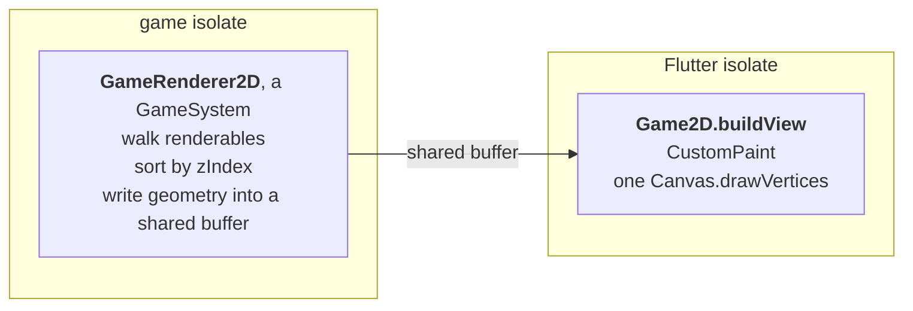

# Rendering and cameras

<!-- snippet-scope
late Sprite sprite;
late Query players;
late Eye eye;
late BoxBody box;
late MyGame game;
double localX = 0, localY = 0, entityWorldX = 0;
-->

!!! abstract "Layer: 2D (`goo2d`)"
    Everything on this page is `goo2d`'s. `goo3d` supplies its own equivalent,
    and the kernel underneath is the same either way.

## How a frame happens

Rendering is two halves on two isolates, and the split is what keeps the Flutter
side cheap:



`GameRenderer2D` composes world transforms and writes vertex data into a shared
native buffer. The Flutter side replays it as a **single `drawVertices` call per
frame** — no `save`, `restore`, `rotate`, `translate` or `drawImage` anywhere in
the replay path. The view is push-driven off tick notifications instead of
polling vsync.

You declare neither half. `Game2D` and `GameState2D` bring both, which is what
makes `extends Game2D` the whole opt-in for 2D rendering.

## Making something draw

Two mixins and one declaration:

```dart
class Player extends EntityStruct
    with Transform2D, WorldTransform2D, Renderable2D {
  late final Sprite sprite;

  @override
  void describeSprites(SpriteDescriptor descriptor) {
    super.describeSprites(descriptor);
    sprite = descriptor.has(width: 64, height: 64, color: 0xFF4FC3F7);
  }
}
```

`WorldTransform2D` is required — the renderer reads world transforms, not local
ones.

## `Sprite`

Everything `descriptor.has` takes becomes a **column**, so every one of these is
per-entity and writable at run time:

<!-- snippet: skip a signature, not a call -->
```dart
Sprite has({
  TextureAsset? texture,
  TextureFilter filter = TextureFilter.mipmap,
  SpriteFrame frame = SpriteFrame.full,
  int color = 0xFFFFFFFF,
  double width = 0,
  double height = 0,
  int zIndex = 0,
  bool visible = true,
  RelativeOffset2D pivot = RelativeOffset2D.center,
  RelativeOffset2D alignment = RelativeOffset2D.zero,
  NineSliceBorder nineSliceBorder = NineSliceBorder.none,
})
```

| Field | Meaning |
|---|---|
| `texture` | The image, or null for a flat colour |
| `color` | ARGB. Multiplied with the texture, so it tints — and is the whole colour when untextured |
| `width`, `height` | Size in world units |
| `zIndex` | Draw order. Higher draws later, on top |
| `visible` | Per-entity on/off, tested before a draw record is ever built |
| `pivot` | Where the sprite's origin sits within itself |
| `alignment` | Stored on the row and read by nothing — see the warning below |
| `frame` | The sub-rectangle of the texture to draw — atlases and sprite sheets |
| `nineSliceBorder` | Stretchable borders for panels and bars |
| `filter` | Sampling: `mipmap`, and the crisp option for pixel art |

!!! warning "`alignment` does not move a sprite"
    It is declared, defaulted, stored and writable through `setAlignment`, and
    the renderer never reads it: two sprites differing only in `alignment` emit
    byte-identical geometry. An alignment is resolved against the size of the
    thing a sprite is anchored to, and a sprite has no such thing yet — so
    what the fraction would be a fraction of is still undecided. Use `pivot`
    for anything within the sprite's own bounds, and a `Transform2D` offset for
    anything else.

The values you pass to `has` are **defaults for every new row**, not fixed
values:

```dart
sprite
  ..color[entity] = 0xFFFF0000
  ..zIndex[entity] = 1000
  ..visible[entity] = false;
```

!!! tip "Hiding is a toggle, not a removal"
    `visible[entity] = false` drops the sprite before it becomes a draw record.
    There is no "remove the renderer component" — see
    [Coming from Unity, Godot or Flutter](mental-model.md).

### Which way a pivot moves the sprite

A pivot's fraction is measured from the texture's top-left, so a `fractionY` of
`0` is the top edge and `1` is the bottom. That is texture space, and texture
space starts at the top in every atlas you are likely to import.

The world it draws into is y-up. The two meet in one fact worth stating
plainly: **moving the pivot down the texture lifts the sprite up in the
world.** The pivot is the point the transform origin sits on, so pushing it
toward the bottom of the image leaves more of the image above the origin.

```dart
sprite.setPivot(entity, const RelativeOffset2D(fractionX: 0.5, fractionY: 1));
```

That anchors a character at its feet. `fractionY` of `1` is the bottom edge of
the texture, and the sprite stands above the entity's position.

The offset you add on top runs the same way, and this is the part that decides
where a collider goes. A pivot `offsetY` of `+20` draws the sprite 20 units
higher; a `Collider2D` offset of `+20` puts a body 20 units higher. So a
collider meant to cover an off-centre sprite takes **the same sign** — and the
same number, when the pivot was nudged with an offset instead of a fraction:

```dart
sprite.setPivot(
  entity,
  const RelativeOffset2D(fractionX: 0.5, fractionY: 0.5, offsetY: 20),
);
box.offsetY[entity] = 20; // matches, and +20 is up for both
```

### Several sprites on one entity

`Renderable2D` is a multi-component, so a prefab can declare more than one:

<!-- snippet: in EntityStruct with Renderable2D -->
<!-- snippet-setup
late Sprite body;
late Sprite muzzleFlash;
late TextureAsset bodyTexture;
late TextureAsset flashTexture;
-->
```dart
@override
void describeSprites(SpriteDescriptor descriptor) {
  super.describeSprites(descriptor);
  body = descriptor.has(width: 64, height: 64, texture: bodyTexture);
  muzzleFlash = descriptor.has(width: 32, height: 32, texture: flashTexture,
                               visible: false, zIndex: 10);
}
```

Toggle `muzzleFlash.visible[entity]` for a frame instead of spawning and
destroying an entity.

## Textures

A texture comes from the generated asset enum. Declare the asset, then hand the
handle to the sprite:

```dart
class Player extends EntityStruct
    with Transform2D, WorldTransform2D, Renderable2D {
  late final TextureAsset texture;
  late final Sprite sprite;

  @override
  void describeAssets(AssetDescriptor descriptor) {
    super.describeAssets(descriptor);
    texture = descriptor.has(Textures.spritesPlayer);
  }

  @override
  void describeSprites(SpriteDescriptor descriptor) {
    super.describeSprites(descriptor);
    sprite = descriptor.has(width: 64, height: 64, texture: texture);
  }
}
```

Declare the asset on **whatever uses it**. `has` is idempotent per identity and
prefabs share their scene's descriptor, so declaring the same texture in a
prefab and its scene yields the identical handle — one address, one decode. See
[Assets](assets.md).

### Atlases and sprite sheets

`SpriteFrame` selects a sub-rectangle of the texture, so many sprites can share
one decoded image — one upload, one batch. A frame is stored as **fractions** of
the texture, and the two named constructors do the division for you at declare
time:

```dart
// A uniform sheet: 8 columns x 4 rows, cell 5 (row-major).
const walk0 = SpriteFrame.grid(columns: 8, rows: 4, index: 5);

// A packed atlas: a pixel rectangle on a sheet whose size you know.
const buttonFace = SpriteFrame.pixels(
  x: 128, y: 64, width: 96, height: 32,
  sheetWidth: 512, sheetHeight: 512,
);

// The default: the whole texture.
const whole = SpriteFrame.full;
```

Both are `const`, so a frame table costs nothing at run time:

```dart
class Player extends EntityStruct
    with Transform2D, WorldTransform2D, Renderable2D {
  final animTime = Field.float64();

  late final Sprite sprite;

  static const List<SpriteFrame> walkCycle = <SpriteFrame>[
    SpriteFrame.grid(columns: 8, rows: 4, index: 0),
    SpriteFrame.grid(columns: 8, rows: 4, index: 1),
    SpriteFrame.grid(columns: 8, rows: 4, index: 2),
    SpriteFrame.grid(columns: 8, rows: 4, index: 3),
  ];

  @override
  void describeSprites(SpriteDescriptor descriptor) {
    super.describeSprites(descriptor);
    sprite = descriptor.has(width: 64, height: 64);
  }
}
```

Then advance it per entity from a system. `animTime` is a `Field.float64()`
column on the prefab, and `12` is the frame rate:

```dart
for (final group in players.groups()) {
  final player = group.get<Player>();
  for (final entity in group) {
    final t = player.animTime[entity] + dt;
    player.animTime[entity] = t;
    final step = (t * 12).floor() % Player.walkCycle.length;
    player.sprite.frame[entity] = Player.walkCycle[step];
  }
}
```

`SpriteFrame.grid` is exact whatever the image's pixel size — the constructor
never asks how big the source is, because it does not need to know.

## Cameras

A camera is an entity: `Transform2D`, `WorldTransform2D` and `Camera`.

```dart
class Eye() extends EntityStruct with Transform2D, WorldTransform2D, Camera;
```

| Column | Meaning |
|---|---|
| `zoom` | Screen pixels per world unit. `1` is 1:1, `2` zooms in, `0.5` out |
| `view` | Which declared `CameraView` this camera fills, or null for none |

<!-- snippet: plain -->
```dart
final camera = scene.addEntity(eye);
eye.view[camera] = game.defaultCamera;
eye.zoom[camera] = 2;
```

`view` is typed, not an integer — a stray int does not compile there.

!!! warning "A camera's rotation is ignored"
    The projection reads the camera's world x, its world y and `zoom`, and
    nothing else. The same scene through a camera at rotation 0 and through
    one at rotation π/2 draws identically, and a camera parented to something
    that turns inherits the turn and still draws upright. A banking view, or
    one locked to a subject's facing, has nothing here to build on
    ([#172](https://github.com/sunarya-thito/good/issues/172)).

### Views

A **view** is a surface a camera can fill. `Game2D` declares one for you:

<!-- snippet: expr -->
```dart
GameView(camera: game.defaultCamera)
```

Declare more when you want split screen, a minimap, or a second window:

```dart
class MyGame extends Game2D {
  late final CameraView minimap;

  @override
  void describeCameras(CameraDescriptor descriptor) {
    super.describeCameras(descriptor);
    minimap = descriptor.has();
  }
}
```

Each view sizes and allocates its own per-view storage, and **each draws the
scene its own camera is in** — so two views can be looking at different scenes
at the same instant.

!!! warning "One camera per view"
    Two cameras pointing at the same view trips a debug assert. A camera
    defines that view's origin, so a second one has no meaning. In release the
    first in query order wins.

    There is no switch that turns a camera off. Setting its `view` to null is
    what takes one out of play.

### No camera at all

A game with no active camera draws at the origin with a zoom of 1, and the whole
world is drawn. A game that has not placed a camera yet shows something, not a
black screen.

`GameView.headless(game: game)` is the other legitimate shape: a HUD-only or
headless-plus-Flutter game, with no camera and nothing painted.

## Coordinate conversion

Going between a `GameView` pixel and world space is a first-class operation —
picking, placing UI at a world position, dragging:

```dart
final projection = getSystem<MousePickingSystem>().projection;
final worldX = projection.viewToWorldX(localX);
final worldY = projection.viewToWorldY(localY);
final viewX  = projection.worldToViewX(entityWorldX);
```

`CameraProjection` re-resolves the active camera and the view size each tick, so
it always reflects the current zoom and viewport.

The **y sign flips here and nowhere else**. World +Y is up and a `GameView`
pixel's y grows downward, so these four methods are the whole of the conversion
between the two. Use them rather than `world - cameraOrigin` by hand, or a
tooltip you place at a world position ends up mirrored about the middle of the
view.

A zoom of zero maps the whole world onto one pixel, so the inverse reports the
camera's own origin, not an infinity that would poison every downstream
comparison silently.

## Budgets

```dart
class MyGame extends Game2D {
  @override
  int get maxSpritesPerTick => 24000;   // default 4096
}
```

This sizes the native frame buffer. Hitting the cap truncates the batch, which
looks exactly like the renderer getting slower unless you can see the count — so
the renderer exposes how many sprites it actually emitted, and
`lastRecordsOverBudget` beside it: how many records the frame asked for and had
to turn away. A debug overlay showing both is worth building early, and the
second is the number to add to `maxSpritesPerTick`.

The cap counts **records, not sprites** — a nine-sliced sprite spends nine of
them — so a screen of nine-sliced panels reaches it nine times sooner than the
entity count suggests. Which sprites go when it runs out is settled by archetype
registration order, which is not a property of your scene: treat being over
budget as something to fix, not as a layer to lose deliberately.

The renderer also reports its three phases — walking renderables into the draw
queue, sorting by z, and writing geometry — separately instead of as one
presentation total, because they are three unrelated costs with three unrelated
fixes and one number cannot direct any of them. See
[Performance](performance.md).

## In-game UI, and when to avoid it

The engine can draw buttons and panels — `NineSliceBorder` stretches borders for
exactly that, and `MouseReceiver` below gives an entity pointer events.

**Prefer Flutter widgets anyway.** Your HUD, menus and inventories should be
ordinary widgets over the `GameView`; make a UI element an entity only when it
is as interactive as the game itself — pinned to a world position, occluded by
the world, or hit tested in world coordinates. See
[Where your UI belongs](flutter-bridge.md#where-your-ui-belongs).

## Mouse picking

`MouseReceiver` gives an entity pointer events, and `MousePickingSystem`
resolves them against its **colliders**. It matches `MouseReceiver`,
`Collider2D` and `WorldTransform2D` together, and tests the cursor against every
enabled body in the entity's own local space — so a rotated, scaled entity
hit-tests as the shape you can see:

```dart
class Button extends EntityStruct
    with
        Transform2D,
        WorldTransform2D,
        Renderable2D,
        Collider2D,
        MouseReceiver {
  late final Sprite sprite;
  late final CircleBody hitArea;

  @override
  void describeSprites(SpriteDescriptor descriptor) {
    super.describeSprites(descriptor);
    sprite = descriptor.has(width: 64, height: 64);
  }

  @override
  void describeCollider(ColliderDescriptor descriptor) {
    super.describeCollider(descriptor);
    hitArea = descriptor.hasCircleCollider(radius: 32);
  }

  @override
  void onMouseEnter(MouseEvent event) { }
  @override
  void onMouseHover(MouseEvent event) { }
  @override
  void onMouseExit(MouseEvent event) { }
  @override
  void onMousePressed(MouseEvent event) { }
  @override
  void onMouseReleased(MouseEvent event) { }
}
```

**A receiver with no collider is never picked, and nothing says so** — it fails
the query, so it is not a candidate at all. That is deliberate rather than an
assert: `Renderable2D`'s bounds are the obvious fallback and the wrong one, since
a sprite is a rectangle even when what it draws is a coin, and clicking the
corner of a coin should miss. The button above carries both, and they disagree:
the cursor 42 units out from the origin is inside the 64×64 sprite, outside the
radius-32 circle, and picks nothing.

Enter, hover, exit, pressed and released are separate phases, so hover feedback
does not have to be reconstructed from raw positions.

Each candidate gets a cheap reject before the exact test: a circle about the
entity's **origin**, wide enough to reach the far side of every body it
declared. Measured from the origin rather than from each body's own offset,
because the origin is the point rotation turns about — a bound measured from
anywhere else swings as the entity spins, and one that comes out too small
drops a click the player aimed correctly. A hit zone hung far off the origin
therefore costs you a looser reject, never a wrong answer.

Picking is scoped the way drawing is: the pointer hits only entities in the
scene the view's camera is in. A second scene resident behind the one on screen
simulates, but nothing in it can be clicked.

---

## Next

[Input →](input.md)
