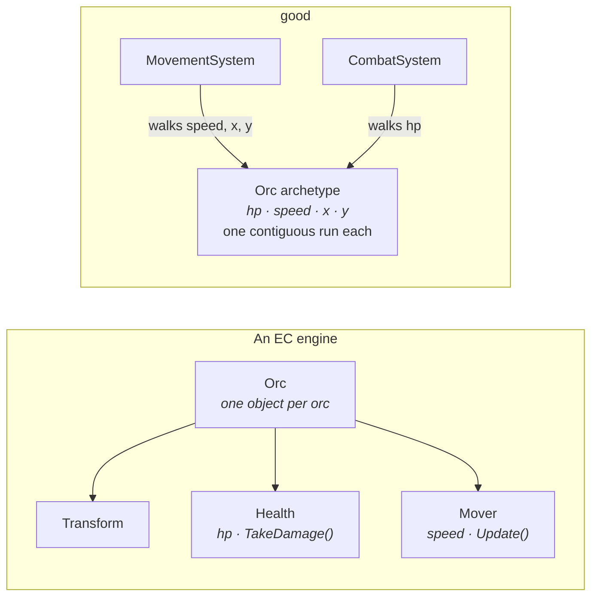

# Thinking in ECS

!!! abstract "Layer: kernel (`good`)"

You already know how to build a game. You know what a player object is, where
the jump code goes, what the health bar reads from. Almost none of that is
wrong here. Most of it needs re-filing.

This page is the re-filing. It is not a list of renamed methods —
[Coming from Unity, Godot or Flutter](mental-model.md) is that, and it reads
well straight after this one. This is the layer underneath: why the engine is
shaped the way it is, what happens to the habits you have built, and worked
answers to the eight things people actually get stuck on.

All of it is kernel (`good`), so it holds in 2D and 3D alike. Where an example
needs something concrete it reaches for `goo2d`, so the components you will see
named — `Transform2D`, `Renderable2D`, `Collider2D` — are that package's and
not the kernel's. The 3D spellings are in
[Transforms and hierarchy (3D)](3d/transforms.md).

## The one thing that moved

In an EC engine, a thing in your game is an object. That object owns its data
*and* its methods. An orc has `hp` on it and a `TakeDamage` beside it, a
`speed` and an `Update` that spends it. The two travel together because they
live on the same instance, and that is the property everything else in that
model rests on.

Here they are separated. Data lives in **columns**: `hp` is a run of integers,
one per orc, with nothing else interleaved. Behaviour lives in **systems**:
loops that open a column and walk it end to end. A system does not know your
orc by name and will never hold a reference to one.



Everything awkward about the move comes from that one split, and so does
everything you gain from it. Keep the split in mind while you read the rest of
the page and the answers stop looking arbitrary.

There is a second surprise waiting, and it belongs to this engine rather than
to ECS generally: **an entity's shape is fixed when its prefab is declared.**
No `AddComponent`, no `RemoveComponent`, nothing appearing at run time. That
one shows up in
[state machines](#state-machines-and-the-advice-you-will-find-elsewhere) below,
and it is the section to read if you read only one.

## Where your behaviour went

Here is the smallest possible MonoBehaviour, and where each half of it lands.

```csharp
// Unity
class Mover : MonoBehaviour {
    public float speed = 200;
    void Update() {
        transform.position += Vector3.right * speed * Time.deltaTime;
    }
}
```

The `speed` field becomes a column on the prefab:

```dart
class Orc extends EntityStruct with Transform2D, Renderable2D {
  final speed = Field.float64(200);   // what a fresh orc starts at
}
```

The `Update` becomes a system:

```dart
class OrcMovementSystem extends GameSystem with FixedTickable {
  late final Query orcs;

  @override
  void describeQuery(QueryDescriptor descriptor) {
    super.describeQuery(descriptor);
    orcs = descriptor.query().withAll(Transform2D, Orc).build();
  }

  @override
  void onFixedUpdate() {
    final dt = game.fixedTimeStep.inMicroseconds / 1000000.0;
    for (final group in orcs.groups()) {
      final transform = group.get<Transform2D>();
      final orc = group.get<Orc>();
      for (final entity in group) {
        transform.transformOffsetX[entity] += orc.speed[entity] * dt;
      }
    }
  }
}
```

Three things in that code trip people up on a first read.

`Orc` appears in a query and it is a prefab, not a component. Every
`EntityStruct` registers its own concrete type as queryable, so
`withAll(Transform2D, Orc)` means "everything that is an orc and has a
transform". You never have to invent a marker component to select one kind of
entity.

`orc.speed` is a column, so `orc.speed[entity]` is the read. There is one `Orc`
object in the whole game and it holds no per-orc values —
[Entities and components](entities-and-components.md#an-entitystruct-is-a-layout-not-an-object)
has the full explanation, and this is the single most common way a first prefab
goes wrong.

The loop has two levels because `group.get<T>()` is the expensive part and a
group is the scope where hoisting it out is correct. Doing it in the inner loop
works and is slow: a profile of this engine put that one mistake at roughly 7%
of total CPU.

!!! tip "You find your `Update` again by reading the query"
    In an EC engine you answer "what runs on this object?" by looking at the
    object. Here you answer it by looking at which queries match its
    archetype. That is a genuine loss of locality and there is no trick that
    gets it back. What you get for it is the other direction, where "what does
    this loop touch?" is answered by the query and is exact.

### Behaviour that belongs to one kind of entity

Not everything wants to be a system. A prefab can carry hooks that fire for its
own entities and nothing else:

```dart
class Orc extends EntityStruct
    with Transform2D, Renderable2D, EntityLifecycleListener {
  // ... `speed` as above

  @override
  void onEntityMounted(Entity entity) {
    super.onEntityMounted(entity);
    speed[entity] = 140 + 60 * _spread();   // per-orc variation at spawn
  }
}
```

`onEntityMounted` is not a method the engine calls on your prefab class. It is
an **event**. `EntityStruct` declares a dispatcher for it, your prefab mixes in
`EntityLifecycleListener`, and the boot pass collects the prefab into that
dispatcher as a listener. Two things follow from that. The mixin is not
decoration — leave it off and the override compiles, is never collected, and
never fires. And `super.onEntityMounted(entity)` matters, because another mixin
further down the chain may be overriding the same hook on the same object.

The effect is close enough to virtual dispatch that you can think of it that
way while you write gameplay: per-*kind* polymorphism survives the move intact.
It is per-*entity* polymorphism inside a tick loop that does not, and that
distinction comes back in [Replacing a base class](#replacing-a-base-class).
The same machinery carries the tick, scene loading and everything else the
engine calls back into, and you can declare events with it yourself — see
[Events and listeners](events.md).

!!! warning "An entity has to be finished when it is mounted"
    If your update loop derives a transform from an angle, write that transform
    at mount too, with the same expression. Leaving it at its default for one
    frame is how an entity appears to flash at the origin on its second frame.

## Reaching another entity

In an EC engine this is a method call through a reference:

```csharp
other.GetComponent<Health>().TakeDamage(5);
```

There is no equivalent. `Health` — the two-column mixin from
[Entities and components](entities-and-components.md#components) — has no
`TakeDamage`, because it is two columns and no methods. What you have instead
is the `Entity` handle, which is an `int`, and columns you can index with it.

### Where an `Entity` comes from

Before any of that is useful you need a handle, and this is the question the
`GetComponent` line above quietly answers with `other`. There are four sources
and no fifth:

`scene.addEntity(prefab)` returns the handle of the row it just allocated. This
is the one that matters most, because it is the only moment the engine will
ever offer you that particular entity unprompted.

Query iteration hands them out in bulk — `for (final entity in group)` inside a
`query.groups()` walk, or `query.run()` when there are only a handful. That is
where the overwhelming majority of your code gets its entities, and it never
has to search for them because the query already matched the archetype.

The hierarchy links are handles in columns, so parent and child are reads:
`child.parent[entity]` gives an `Entity?`, and `parent.firstChild[entity]` with
`child.nextSibling[entity]` walks a subtree. See
[Transforms and hierarchy](transforms-and-hierarchy.md).

Events deliver one as their payload: `onEntityMounted(Entity entity)`,
`onEntitySpawned`, and `sourceEntity`/`targetEntity` on a collision event.

Once you hold one, `entity.get<T>()` and `entity.tryGet<T>()` reach every
component its prefab declared, which is the next section.

!!! danger "There is no `Find`"
    No `FindObjectOfType`, no lookup by name, no lookup by tag. An entity has
    no name and no tag — it is a packed integer naming a row, and nothing in
    the engine indexes them by anything else. **You keep the handle at the
    point you spawn it**, in an ordinary Dart field on the scene or the system
    that spawned it:

    ```dart
    class Arena extends SceneStruct {
      late final Player player;
      late Entity playerEntity;

      @override
      void onSceneMounted(Scene scene) {
        playerEntity = scene.addEntity(player);
      }
    }
    ```

    Any system then reads `getScene<Arena>().playerEntity` with no search at
    all. The full version, and when a one-entity query is fine anyway, is in
    [The player, and the game manager](#the-player-is-an-entity-but-you-do-not-have-to-search-for-it).

A handle stored in a plain field is safe as long as the entity outlives it.
Where that is not certain, read
[what happens when the target is destroyed](#what-happens-when-the-target-is-destroyed)
before you write the field.

### Reading another entity's data

Given a handle, resolve the component it belongs to and index:

```dart
final health = target.get<Health>();
health.hp[target] -= 5;
```

`get<T>()` is a list index and a type test. Cheap, but not free, and it is one
lookup per link. For the entity you are *walking* you hoist it per group and
never pay it again. For a **cross-reference** you cannot hoist it, because the
thing you point at may sit in a different archetype from one entity to the
next. That cost is the price of the link, and it is why a design where every
entity chases three others every tick will not feel fast here.

Once you have the component, everything that prefab mixes in is reachable
through the same object. `Orc` mixes in `Transform2D`, so it answers for
position too:

```dart
final orc = target.get<Orc>();
final tx = orc.transformOffsetX[target];
final ty = orc.transformOffsetY[target];
```

### Storing a handle in a column

`Field.entity()` declares a column of `Entity` handles. It is the same 64-bit
column the packed handle has always been stored in, with the type on it, so a
handle and a score can no longer be assigned to each other:

```dart
final owner = Field.entity();
```

Where the link can be absent — which is the usual case — `Field.optEntity()` adds a
presence flag beside the handle, so `null` is the "no target" state. That
matters because `Entity(0)` is a real handle (archetype 0, page 0, row 0), so
there is no spare value to reserve as a sentinel. The engine's own hierarchy
links are built that way:

```dart
class Missile extends EntityStruct with Transform2D, Renderable2D {
  final target = Field.optEntity();
  final targetStamp = Field.int64();  // which entity that handle meant
}
```

```dart
missile.target[entity] = orcEntity;
```

The flag is a bit declared ahead of the handle, and the handle then rounds up
to its own byte — so the column takes 72 bits rather than `hasEntity()`'s 64,
unless a sub-byte field declared just before it left room in the byte for the
flag to land in.

### What happens when the target is destroyed

This is the part that will catch you out, so read it twice.

**An `Entity` carries no generation counter.** There are no spare bits in the
handle for one. A destroyed row is freed and then handed to the next
`addEntity` of the same archetype, and that new entity's handle is numerically
equal to the old one. A stale handle does not dangle in any way you can detect.
It silently starts naming something else.

The engine's own advice is to hold handles for the duration of a tick and not
across ticks. Where you genuinely need a link that outlives a tick, put a
number beside it that only the intended entity carries:

```dart
class Orc extends EntityStruct
    with Transform2D, Renderable2D, Health, EntityLifecycleListener {
  final stamp = Field.int64();

  int _nextStamp = 1;   // per-prefab counter, not per-entity state — this is fine

  @override
  void onEntityMounted(Entity entity) {
    super.onEntityMounted(entity);
    stamp[entity] = _nextStamp++;
  }
}
```

The missile keeps both halves and checks them together before it trusts the
handle:

```dart
for (final group in missiles.groups()) {
  final missile = group.get<Missile>();
  final transform = group.get<Transform2D>();
  for (final entity in group) {
    final raw = missile.target[entity];
    if (raw == null) continue;

    final target = Entity(raw);
    final orc = target.tryGet<Orc>();
    if (orc == null || orc.stamp[target] != missile.targetStamp[entity]) {
      missile.target[entity] = null;      // whatever it named is gone
      continue;
    }

    final dx = orc.transformOffsetX[target] - transform.transformOffsetX[entity];
    // ... steer toward it
  }
}
```

`tryGet` catches the case where the row was recycled by a different archetype;
the stamp catches the case where it was recycled by the same one. Together they
come as close to a weak reference as the storage model allows.

!!! info "Parenting is the link you do not have to maintain"
    A turret on a tank, a health bar over a head, a limb on a body — reach for
    the [hierarchy](transforms-and-hierarchy.md) instead of a handle column.
    Destroying the parent takes its whole subtree with it, so the dangling case
    never arises, and the world transform is composed for you.

!!! warning "The stamp is not readable on the tick the orc mounted"
    A read returns the last published snapshot, and a write made in
    `onEntityMounted` publishes at the end of that step. If you lock a missile
    onto an orc spawned in the same tick, keep the number the spawner used
    instead of reading it back. See
    [same-tick reads](entities-and-components.md#same-tick-reads).

## Replacing a base class

`class Orc : Enemy : Character` is three levels of inheritance carrying three
sets of fields and a stack of virtual methods. Composition takes it apart into
mixins, each contributing columns and a queryable type.

```dart
mixin Character on Component {
  final moveSpeed = Field.float64(120);
  final turnSpeed = Field.float64(4);

  @override
  void describeType(ComponentDescriptor component) {
    super.describeType(component);
    component.has<Character>();
  }

}

mixin Hostile on Component {
  final aggroRadius = Field.float64(220);
  final contactDamage = Field.int32(5);

  @override
  void describeType(ComponentDescriptor component) {
    super.describeType(component);
    component.has<Hostile>();
  }
}
```

The leaves are flat:

```dart
class Orc()    extends EntityStruct with Transform2D, Renderable2D, Health, Character, Hostile;
class Goblin() extends EntityStruct with Transform2D, Renderable2D, Health, Character, Hostile;
class Player() extends EntityStruct with Transform2D, Renderable2D, Health, Character;
```

And the thing an inheritance tree was really for — writing one piece of code
that covers a whole branch of it — is a query:

```dart
everyone  = descriptor.query().withAll(Character).build();            // all three
enemies   = descriptor.query().withAll(Character, Hostile).build();   // two
civilians = descriptor.query().withAll(Character).withNone(Hostile).build();
```

That last one has no clean equivalent in a class hierarchy at all. "Everything
that is a character and is *not* hostile" is one query clause here and a visitor
or a runtime type test there.

### What is genuinely more awkward

Three things, and pretending otherwise would waste your time.

**There is no `override` for tick behaviour.** If `Orc` must move differently
from `Goblin` at the same point in the same loop, you cannot override a method
on `Orc`. Your options are a branch on a column, a second query that selects
only orcs, or a separate system. Virtual dispatch per entity per tick is
precisely the cost the layout exists to remove, so it is not coming back.

Per-kind hooks are the exception, and they cover more ground than you would
guess. `onEntityMounted` and `onEntityUnmounted` are events your prefab hears
by mixing in `EntityLifecycleListener`; `onCollisionEnter2D` and its five
siblings arrive through `CollisionListener`, which the physics system resolves
at the contact with `entity.tryGet<CollisionListener>()`. Different machinery,
same result at the call site: one override on the prefab class, run once per
event. Polymorphism survives at prefab granularity. It does not survive inside
the walk.

**Shared code needs a shared mixin.** A helper that works over "anything with
health" needs `Character` to be a real mixin that every prefab applies. Two
prefabs that happen to have identically named fields share nothing; identity
comes from the declaration, never from the field names.

**`super` discipline is load-bearing.** Every `describeType` override must call
`super`, because each mixin in the chain contributes. Skipping it silently drops
everything below it, and the failure surfaces much later as a query matching
nothing. There is no equivalent footgun in a class hierarchy, where the compiler
wires the base constructor for you. Columns are exempt now that they are field
initialisers - Dart runs the whole chain of those without being asked.

### When to stop and write a second prefab

Deep hierarchies usually exist because a middle class held fields only some
leaves ever used. Here that middle class is a mixin and a leaf either applies
it or does not, so the problem mostly dissolves. What is left is the case where
two kinds of thing share a name and nothing else — see
[when the difference is big](mental-model.md#when-the-difference-is-big-separate-prefabs).

## State machines, and the advice you will find elsewhere

Search for "state machine in ECS" and you will find one answer, repeated
everywhere: model each state as a component and move an entity between states
by **adding and removing those components at run time**. An idle enemy carries
`Idle`; when it notices you, remove `Idle` and add `Chasing`; the chase system's
query picks it up, because the query does the filtering for you. Unity DOTS
teaches this. Entitas teaches this. So does most of the tutorial writing in
between, usually under the name existence-based processing.

!!! danger "None of it compiles here"
    good has no `addComponent` and no `removeComponent`. An entity's shape is
    fixed when its prefab is declared and stays fixed for that entity's whole
    life. Every state-machine recipe built on structural change is untypeable
    in this engine, not merely discouraged.

    The three reasons are in
    [Why an entity cannot change shape](mental-model.md#why-an-entity-cannot-change-shape).
    The short version: an archetype *is* the storage, so changing an entity's
    component set means copying its row somewhere else and invalidating every
    handle that pointed at it.

Here is what to write instead. Three shapes, and between them they cover
everything.

### An enum in a column, for states that exclude each other

This is the engine's own pattern. `RigidBody2D` declares its body type with
`Field.enumOf`, which stores the member's index in the narrowest column it fits —
two bits for three or four members. Your gameplay states work the same way:

```dart
enum OrcState { idle, chasing, attacking, staggered }

class Orc extends EntityStruct with Transform2D, Renderable2D, Character {
  final state = Field.enumOf(OrcState.values, OrcState.idle);  // two bits
  final stateTime = Field.float64();

  /// The one place a transition happens, so entry work has one home.
  void enter(Entity entity, OrcState next) {
    state[entity] = next;
    stateTime[entity] = 0;
  }
}
```

The system is a `switch` inside the walk you were doing anyway:

```dart
@override
void onFixedUpdate() {
  final dt = game.fixedTimeStep.inMicroseconds / 1000000.0;
  for (final group in orcs.groups()) {
    final orc = group.get<Orc>();
    final transform = group.get<Transform2D>();
    for (final entity in group) {
      orc.stateTime[entity] += dt;

      switch (orc.state[entity]) {
        case OrcState.idle:
          if (_playerIsNear(entity)) orc.enter(entity, OrcState.chasing);
        case OrcState.chasing:
          transform.transformOffsetX[entity] += orc.moveSpeed[entity] * dt;
          if (_playerIsClose(entity)) orc.enter(entity, OrcState.attacking);
        case OrcState.attacking:
          if (orc.stateTime[entity] > 0.4) orc.enter(entity, OrcState.idle);
        case OrcState.staggered:
          if (orc.stateTime[entity] > 0.8) orc.enter(entity, OrcState.idle);
      }
    }
  }
}
```

`OnStateEnter` and `OnStateExit` have no framework equivalent and do not need
one. `enter` is the only place a transition is written, so entry work goes
there, and exit work goes there too, keyed off the state being left.

!!! warning "One accumulating write per column per tick"
    `stateTime[entity] += dt` reads the **published** value and writes the
    pending one. Two such increments in the same tick both read the same
    published number, so the second overwrites the first and the total is short
    by one step. Keep exactly one system responsible for advancing any given
    column. This is [same-tick reads](entities-and-components.md#same-tick-reads)
    seen from the writing side, and it is worth internalising before you write
    your third system.

### Flags, for states that overlap

Stunned, burning, invulnerable and shielded are not one state machine. They are
four independent bits, and an enum cannot hold them at once:

```dart
final burning = Field.boolean();        // one bit each
final invulnerable = Field.boolean();
```

```dart
for (final entity in group) {
  if (orc.invulnerable[entity]) continue;
  // ...
}
```

Be clear about what this gives up, because it is the one real thing the
add-and-remove approach was buying. **A `bool` column is not queryable.** Only
components are. Where existence-based processing would have the query hand your
system three burning orcs out of ten thousand, here the loop visits all ten
thousand and skips 9,997 of them with a branch.

That branch is a bit test on a byte the loop had already pulled into cache and
it predicts almost perfectly, so the cost is small and flat. It is not zero. If
the split is genuinely enormous and genuinely permanent — a thousand corpses
that will never move again beside fifty live enemies — that is the case for the
third shape.

### Separate prefabs, for states that are really different kinds of thing

Two prefabs are two archetypes, two runs of memory, and two things a query can
select independently. Nothing is skipped, because nothing that does not belong
is in the run.
[Coming from Unity, Godot or Flutter](mental-model.md#when-the-difference-is-big-separate-prefabs)
has the rule of thumb: a flag for a state an entity moves in and out of, a
prefab for a kind of thing it simply is.

The cost is that an entity cannot move between prefabs. Turning a live orc into
a corpse means destroying one entity and spawning another, which loses the
handle and every link pointing at it.

### Sequences, which want a coroutine

A state machine is the wrong tool for "wind up, swing, recover, cool down".
That is a script, and scripts are what
[coroutines](coroutines-and-animation.md) are for:

```dart
Iterable attack(Entity self) sync* {
  orc.enter(self, OrcState.attacking);
  yield 0.25;                              // wind-up, in simulated seconds
  _swing(self);
  yield 0.15;
  yield WaitUntil(() => !_blocked(self));
  orc.enter(self, OrcState.idle);
}
```

```dart
startCoroutineWithParam(attack, param: entity);
```

Pass the function, not a call to it, and use the parameterised form for
anything per-entity. Wrapping it in a closure allocates one per start, on a
path that runs during gameplay.

## Events and callbacks

`OnCollisionEnter` is the one callback that survives the move almost unchanged,
because it was already a per-kind event and not a per-entity method.

### Collisions and triggers

The handlers are ordinary overrides on the prefab. The entity arrives as part
of the event, since one prefab is shared by every orc:

```dart
class Orc extends EntityStruct
    with Transform2D, Renderable2D, Health, Collider2D, RigidBody2D,
         CollisionListener {
  @override
  void onTriggerEnter2D(Collision2DEvent event) {
    final self = event.sourceEntity;
    final bullet = event.targetEntity.tryGet<Bullet>();
    if (bullet == null) return;

    hp[self] -= bullet.damage[event.targetEntity];
    event.targetEntity.destroy();
  }
}
```

Enter, stay and exit are separate phases for collisions and for triggers, so
"did we just land" never has to be reconstructed from a stream of contacts.

!!! danger "Do not keep the event object"
    One `Collision2DEvent` instance is reused for every dispatch in the step,
    and its fields are overwritten before the next call. Read what you need
    during the callback and keep that. The `Entity` values are packed ints and
    are safe to hold for the tick; the wrapper around them is not.

### Two hits in one tick

That snippet has a bug a shotgun will find and a pistol will not. `hp[self] -=
d` reads the published value and writes the pending one, so two contacts in the
same tick both start from the same published `hp` and the second write replaces
the first. Two bullets, one bullet's worth of damage.

If your design gives the victim invulnerability frames, one hit per tick is all
you wanted and there is nothing to fix. Otherwise, stop accumulating through a
column inside the handler. Report the hit to a system and let the system apply
one write per victim, after the physics step has finished:

```dart
class DamageSystem extends GameSystem with FixedTickable {
  final List<int> _victims = <int>[];   // packed Entity values
  final List<int> _amounts = <int>[];

  /// Called from a collision handler. `add` allocates only when the buffer
  /// grows, so after the first few ticks it is reused.
  void report(Entity victim, int amount) {
    _victims.add(victim.value);
    _amounts.add(amount);
  }

  /// After the solver, so every contact for this step is already in.
  @override
  int compareTo(GameSystem other) => other is Box2DPhysicsSystem ? 1 : 0;

  @override
  void onFixedUpdate() {
    for (var i = 0; i < _victims.length; i++) {
      var total = _amounts[i];
      if (total == 0) continue;
      // Fold in every later hit on the same victim, so this is one write.
      for (var j = i + 1; j < _victims.length; j++) {
        if (_victims[j] == _victims[i]) {
          total += _amounts[j];
          _amounts[j] = 0;
        }
      }
      final victim = Entity(_victims[i]);
      final health = victim.get<Health>();
      health.hp[victim] -= total;
    }
    _victims.clear();
    _amounts.clear();
  }
}
```

The handler reaches the system through `getSystem`, which every `EntityStruct`
has. Cache it, because one call per contact is one map lookup per contact:

```dart
DamageSystem? _damage;

@override
void onTriggerEnter2D(Collision2DEvent event) {
  final bullet = event.targetEntity.tryGet<Bullet>();
  if (bullet == null) return;
  (_damage ??= getSystem<DamageSystem>())
      .report(event.sourceEntity, bullet.damage[event.targetEntity]);
  event.targetEntity.destroy();
}
```

### Your own events

There is no `EventEmitter` to instantiate and no event class to write. What the
engine gives you is three widths of listener, and you pick one by asking how
wide the question is.

A prefab that only wants to hear about *its own* entities mixes in
`EntityLifecycleListener` and overrides `onEntityMounted`. A system that wants
to hear about **every** entity in the game mixes in `EntitySpawnListener` and
filters by archetype itself, which is what a spatial index or a replication
table wants:

```dart
class SpatialIndexSystem extends GameSystem with EntitySpawnListener {
  @override
  void onEntitySpawned(Entity entity) {
    if (entity.tryGet<Collider2D>() != null) _index.insert(entity);
  }

  @override
  void onEntityDespawned(Entity entity) => _index.remove(entity);
}
```

The same split exists for scenes — `SceneLifecycleListener` for your own,
`SceneLoadListener` for all of them — and `GameLifecycleListener` covers the
game coming up and going down.

For an event of your own — "wave cleared", "player levelled up" — you declare a
dispatcher in `describeEvents`, put it on the owner whose reach you want, and
write a listener mixin bound `on GameListener` that anything can apply. It is
the same three-piece shape every built-in event above is built from, and
[Events and listeners](events.md) walks one through end to end.

Reach for it when the news has to travel to listeners you do not know at
declare time. When one system just needs to tell one other system, call the
method: both ends are on the same isolate and `getSystem<T>()` already gives
you a typed handle.

### Events that have to reach the UI

A game event a widget shows does not travel as an event at all. Numbers go out
through [state channels](flutter-bridge.md#state-channels), which the Flutter
isolate reads straight out of shared memory; actions come in as
[commands](flutter-bridge.md#commands). No shared mutable object between the
two sides, and no listener list spanning them.

## The player, and the game manager

Writing a system that iterates one entity feels ridiculous the first time. It
usually means the thing is not an entity.

### A game manager is not an entity

Score, wave number, whether the game is paused, how many enemies to keep alive:
none of that is per-entity data, so none of it belongs in a column. It goes in
an ordinary Dart field on your `GameState` or on a system, and that is not a
workaround:

```dart
class ArenaState extends GameState2D<ArenaGame> {
  int wave = 1;
  int score = 0;
  int targetPopulation = 40;
}
```

The example demos in this repository do exactly this. `targetPopulation` lives
on the state, a system reads it and converges the world on it, and nothing
about it ever touches component storage.

A system may hold scratch state the same way. `SwirlSystem` in the particles
demo keeps its own `double _time` and a `Stopwatch`, both plain fields.

!!! warning "A `SceneStruct` is not the place for it"
    One `SceneStruct` can back several loaded scenes at once, so a mutable
    field on it is shared by all of them. See
    [declaration versus instance](scenes.md#declaration-versus-instance).

### The player is an entity, but you do not have to search for it

The player has a transform, a sprite and a collider, so it is an entity. That
does not mean a system should run a query to find it every tick. The scene that
spawned it already knows:

```dart
class Arena extends SceneStruct {
  late final Player player;
  late final Orc orc;

  late Entity playerEntity;   // scene *content*, not per-instance config

  @override
  void describeScene(SceneDescriptor descriptor) {
    super.describeScene(descriptor);
    player = descriptor.has(Player.new);
    orc = descriptor.has(Orc.new);
  }

  @override
  void onSceneMounted(Scene scene) {
    playerEntity = scene.addEntity(player);
    for (var i = 0; i < 20; i++) {
      scene.addEntity(orc);
    }
  }
}
```

Any system reads it directly:

```dart
final arena = getScene<Arena>();
final px = arena.player.transformOffsetX[arena.playerEntity];
```

One field read and one indexed column read. No query, no search, no
`FindObjectOfType`.

### When a query over one entity is fine anyway

Cameras are the standard case: there are one or two of them and they want the
same per-tick treatment as everything else. `query.run()` yields entities
directly with no per-group resolution, which is wasteful for thousands and
perfectly reasonable for three:

```dart
for (final entity in cameras.run()) {
  // ...
}
```

The rule of thumb is about count, not about principle. A query is a compiled
archetype match, so matching one archetype holding one row costs almost
nothing. Use the stored handle when you have one; use `run()` when you do not
and there are only a handful.

## Spawning and destroying while you iterate

In an EC engine, destroying an object during a `foreach` over a list of them is
a crash or a silent skip, and everyone learns to collect a kill list. Here it
is supported directly, and the mechanics are worth knowing because they explain
some frame-boundary behaviour that otherwise looks like a bug.

### Destroying from inside the loop that found it

```dart
for (final group in motes.groups()) {
  final mote = group.get<Mote>();
  for (final entity in group) {
    final remaining = mote.life[entity] - dt;
    if (remaining <= 0) {
      entity.destroy();
      continue;
    }
    mote.life[entity] = remaining;
    // ...
  }
}
```

Freeing a row is deferred while a query walk is open, so the row stays readable
for the rest of the walk and is handed to the next spawn afterwards.
`entity.destroy()` also takes the entity's whole subtree with it and fires the
unmount and despawn events while the row is still readable, which is what lets
a physics backend release the body it allocated for that entity.

!!! warning "A destroyed entity is still walked for the rest of the step"
    Its row is not released until the start of the next fixed step. Systems
    that run after yours in the same step will still visit it, and so will the
    presentation pass. If anything else would act on it, turn its parts off as
    well as destroying it:

    ```dart
    sprite.visible[entity] = false;
    entity.destroy();
    ```

### Spawning

A row created while a walk is open is **not** visited by that walk. Spawn at
the end of the loop and treat the new entity as arriving on the next step,
which is what the example demos do:

```dart
final shortfall = state.targetPopulation - alive;
if (shortfall > 0) {
  final batch = shortfall < _maxSpawnPerTick ? shortfall : _maxSpawnPerTick;
  for (var i = 0; i < batch; i++) {
    scene.addEntity(prefab);
  }
}
```

The per-tick cap is not ceremony. Allocating several thousand rows in one step
reads as a stall on the frame graph, and converging over a handful of steps
reads as a fill. See [rate-limiting spawns](scenes.md#rate-limiting-spawns).

Spawning belongs on the game isolate: a system, a state hook, or a command
handler. A button in your Flutter UI sends a
[command](flutter-bridge.md#commands) that a game-side handler turns into an
`addEntity`.

## Debugging without an inspector

Losing the inspector is the loss people feel most, and it is a real loss. There
is no panel showing a live object with its fields, because there is no object.
Four things replace it, and between them they cover more ground than the panel
did.

**Put the numbers on screen.** This is the big one and the habit worth building
first. A system publishes counters through
[state channels](flutter-bridge.md#state-channels) and a Flutter overlay reads
them with a `ValueListenableBuilder`. The example demos ship exactly this:

```dart
class ArenaStats extends GameSystem with Tickable {
  @override
  void onTick(Duration delta) {
    final game = getGame<ArenaGame>();
    final state = getState<ArenaState>();
    game
      ..wave.value = state.wave
      ..alive.value = state.aliveCount
      ..score.value = state.score;
  }
}
```

Publish from `Tickable`, not `FixedTickable`. Phase totals are only complete
once the fixed step has returned, and a value published mid-step is wrong in a
way that looks plausible.

**Read the world from Flutter directly.** Both isolates run the same
declarations and share the same pages, so an `Entity` resolves on the Flutter
side with no message and no copy. Get the handle across once — it is an `int`,
so it fits in a single command parameter — and a debug widget can then read any
column on it live:

```dart
final playerEntity = Entity(await game.whoIsPlayer());
final transform = playerEntity.get<Transform2D>();
final x = transform.transformOffsetX[playerEntity];   // published snapshot
```

That is the closest thing to an inspector here, and unlike an inspector you
write it once and it shows exactly the fields you care about.

**Bisect with systems, not with objects.** In an EC engine you find a
misbehaving script by switching components off one at a time. Here you switch
systems off, which is the same move at a coarser grain:

```dart
state.disableSystem<OrcMovementSystem>();
```

A disabled system is excluded from event dispatch entirely, so it costs nothing
while off, and this is reachable from the Flutter side through a command — the
same mechanism a pause menu uses.

**Breakpoints still work.** A system's loop is ordinary Dart. The debugger
shows you `entity` as a large integer, which is not useful on its own; add a
watch expression on `orc.hp[entity]` and you get the row. Use
`assert(false, 'message')` for framework-level problems instead of `print`,
which is swallowed in release and invisible in test output.

!!! tip "Most of your game is not on the Flutter isolate"
    `flutter run --profile` and the DevTools timeline show you the Flutter
    isolate. The simulation is somewhere else. A frame that looks idle on the
    UI thread can still be late because `advance` ran long on the other one,
    which is what the advance timing and step count on your overlay are for.
    See [Performance](performance.md).

## Why any of this is worth it

The common complaint about ECS is fair: it feels like being made to optimise
before you have a game. Here is the actual reasoning, in the order it makes
sense, with the numbers last.

### What a CPU does with memory

A processor does not read one number at a time. It reads a whole block —
typically 64 bytes — and keeps it in a small fast store next to the core. If
the next value you ask for is already in that block, the read is nearly free.
If it is not, the core stalls while the block is fetched, and the stall is long
enough that the same time would have run a hundred arithmetic instructions.

An object-per-entity engine hands the core the second case over and over. Each
orc is an object somewhere in the heap. Its transform is a separate object
again. The list you are looping over holds references, so
`orcs[i].transform.position.x` is three hops before you touch a number, and
every hop is a fresh chance to miss. When the block finally arrives it is
mostly things this loop did not want: the header, the type pointer, the sprite
reference, the fields belonging to some other system entirely.

Struct-of-arrays turns that inside out. Every orc's `x` sits next to every
other orc's `x` in one run of memory, and every `y` in another. A loop adding
velocity to position walks two runs front to back. The first read pulls in a
block that already holds the next several entities' worth of the value it
wants, and the hardware sees the straight-line pattern and starts fetching
ahead of you. Nothing in the block is wasted, because nothing else is in it.

That is the whole idea, and the rest of the engine's shape follows from it.
Entities are numbers so they can be row indices. Components are columns so a
loop touches one run. Systems walk archetypes so that every row in the run
really does match — no type test, no null check, no skipping.

### What it buys, measured

None of the numbers below is a comparison of struct-of-arrays against
array-of-structs, so do not read them that way. They are what this engine
measured while removing indirection from its own read path, which is the same
family of cost and the reason the read path looks the way it does.

| What changed | Before | After |
|---|---|---|
| Column access through a `dart:ffi` `Pointer` field vs a plain `int` address | 14.63 ns | 2.25 ns |
| `WorldTransformSystem`, end to end at 10k entities | 249 ns/entity/tick | 91 ns/entity/tick |

The first row is a microbenchmark (`tool/column_dispatch_bench.dart`) and the
second is the same fix seen from the top
(`goo2d/tool/world_transform_bench.dart`). In the breakdown, generics cost
about nothing and megamorphic dispatch about 1.3 ns. Roughly 12 ns of that
14.63 was one heap object being allocated per field read. That is the size of
the effect a single unnecessary indirection has in a loop that runs per entity
per tick.

Two more that shape everyday code. Resolving a component per entity instead of
per archetype showed up in a profile at about 7% of engine CPU, which is why
queries hand you groups. And a page costs **3×** its size resident, because
each one is a triple buffer — one slot being written, one published, one in
reserve — which is what lets the Flutter isolate read a coherent snapshot with
no lock and no copy.

!!! danger "Measure in AOT, on a device"
    `flutter test` runs the JIT, and JIT numbers from this engine have been
    wrong by roughly two orders of magnitude for write-path costs. Compile any
    benchmark whose result would change code:

    ```bash
    dart compile exe bench/my_bench.dart -o build/my_bench
    ./build/my_bench
    ```

    And check that your benchmark could have failed. Two benches in this
    repository reported "no effect" because their setup made the effect
    unobservable. See [Performance](performance.md).

### What it costs you, and when

Now the other side, which most ECS writing skips.

**You pay up front.** Adding a field means picking a width and a default. There is no inspector to drag a value into, so tuning a
number means a constant in code or a slider you wired yourself. Behaviour that
would have been ten lines in a MonoBehaviour becomes a class, a query and a
registration. Three files open where one used to be.

The payoff is also not on the timescale of a prototype. A traditional engine
holding three hundred objects is fine on any machine built this decade, and a
layout that wins at twenty thousand entities wins nothing at three hundred. If
you are making a puzzle game or a jam entry and you already know Unity or Godot
well, frame time is not the reason to be here. Say that out loud before you
commit a weekend to porting something.

What the layout does buy is that your code stops changing shape as the count
grows. A system walking ten entities and a system walking fifty thousand are
the same fifteen lines. Games built on an object graph that outgrow it usually
have to be taken apart to get past it, and taking a game apart at that stage is
the expensive kind of work. Not having to is most of the argument.

None of this is a request that you hand-optimise. The layout is settled when
you declare the prefab and you write ordinary loops afterwards. The set of
rules that touches everyday game code is short — indexed `for` in a tick,
resolve components per group, no objects built per entity per tick — and it
fits on the checklist at the end of [Hot-path rules](../reference/rules.md).

---

## Next

Now that the model makes sense, [Coming from Unity, Godot or Flutter](mental-model.md)
is the translation table: the call you would have written, and what to write
instead.

For the machinery underneath, [Architecture](architecture.md) covers the two
isolates and the tick.
