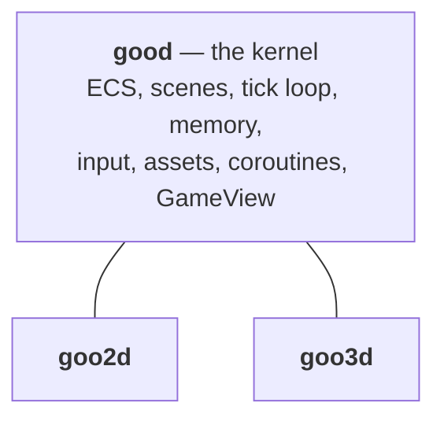

# Dimensions — 2D and 3D

good is a **family**. `good` is the kernel, and an engine package sits on it:
`goo2d` for 2D, `goo3d` for 3D.



Each renderer sits directly on the kernel and supplies its own drawing: `goo2d`
paints into a Flutter `Canvas`, `goo3d` drives a native surface. Neither depends
on the other, and `GameView` is the same widget either way.

## What is shared

These are kernel concepts, and they are **identical** whichever dimension you
work in:

- `Game`, `GameState`, the two-isolate model, the fixed tick
- `EntityStruct`, `Entity`, `Component`, `DataPointer`, archetypes
- `SceneStruct`, `Scene`, loading and unloading
- `GameSystem`, `Query`, `QueryBuilder`, system ordering
- `Child`/`Parent` and the hierarchy — parenting is not a 2D idea
- Input: actions, bindings, keys, gamepads
- Assets: the registry, `AssetKey`, `AssetSource`, `AssetPack`, the CLI pipeline
- Coroutines and timelines
- Commands, state channels, buffers
- `GameView`, and the whole Flutter bridge
- Networking, when you add it
- The `good` CLI — `create`, `generate`, `assets`, `build`

## What is per-dimension

A short list, and it is the whole difference:

| Concern | 2D | 3D |
|---|---|---|
| Transform | `Transform2D`, `WorldTransform2D` | `Transform3D`, `WorldTransform3D` |
| Rotation | one angle | a quaternion, four columns |
| Camera | `Camera` with `zoom` | `Camera3D` with `fieldOfView`, `near`, `far` |
| Drawing | `Renderable2D`, `Sprite`, `GameRenderer2D` | `Renderable3D`, `MeshAsset`, `MaterialAsset`, `Light3D` |
| Geometry | `Collider2D` — circle, box, capsule, polygon | `Collider3D` — box, sphere, capsule, hull, mesh |
| Physics | `goo2d_physics_box2d` (Box2D v3) | `goo3d_physics_box3d` (Box3D) |
| Renderer | Flutter `Canvas`, one `drawVertices` per frame | Filament, a draw call per material |
| Up axis | +Y down, screen space | +Y up, right-handed |
| Game pair | `Game2D`/`GameState2D` | `Game3D`/`GameState3D` |

## Which one a project uses

```bash
good create my_game --dimension=d2    # goo2d — the default
good create my_game --dimension=d3    # goo3d
```

One CLI scaffolds either, and everything after the scaffolding step is the same.

## 2D and 3D do not share a renderer

The costs are not shared. A 2D renderer that carried 3D's transform
maths, its depth handling and its material model would pay for all of it in
every sprite batch — and a 3D renderer built as a special case of a sprite
renderer would fight the sprite renderer's assumptions forever.

The split also has a second payoff that has nothing to do with 3D: because the
kernel has no renderer in it, a **headless dedicated server** can depend on
`good` plus physics plus `good_net` and never pull in a rendering package at all.

## Writing code that works under both

Shared code — an inventory system, a state machine, a networking layer — should
live against the kernel, not against `goo2d`:

```dart
import 'package:good/good.dart';        // not goo2d

class InventorySystem extends GameSystem with FixedTickable {
  late final Query holders;

  @override
  void describeQuery(QueryDescriptor descriptor) {
    super.describeQuery(descriptor);
    holders = descriptor.query().withAll(Inventory).build();
  }
}
```

Anything that names `Transform2D` or `Sprite` is 2D code, and that is the line.
A package of shared gameplay logic that depends on `good` alone works in both
dimensions unchanged.

!!! note "Games do not need to do this"
    A game is written for a dimension and should just depend on `goo2d` and
    import one library. The kernel-only discipline is for **shared libraries**
    meant to serve both.
