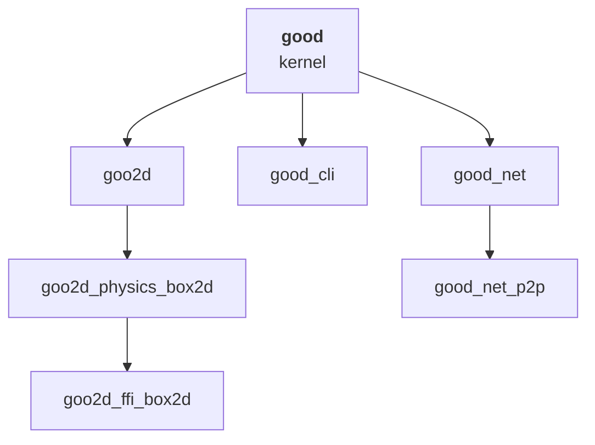

# The packages

good — **G**ame **O**verdrive **O**n **D**art — is a monorepo of packages that
divide along one line: **is this about drawing, or about everything else?**
The kernel is `good`, and the engines built on it are `goo2d` and `goo3d`.

The ECS, the scheduler, scenes, hierarchy, input, the asset registry, the
isolate bootstrap, networking and the CLI are shared. Rendering, transforms and
the physics binding belong to an engine.

```
packages/
├── good                     the kernel both engines are built on
├── good_cli                 the `good` command
├── good_net                 declared messages + the transport contract
│   └── good_net_p2p         serverless P2P backend
│
├── goo2d                   the 2D engine
│   ├── goo2d_physics_box2d  Box2D physics for it
│   └── goo2d_ffi_box2d      vendored Box2D + C shim + bindings
│
└── goo3d                   the 3D engine, and its own siblings
```

`goo2d` and `goo3d` each sit directly on the kernel, and the split costs nothing
above it. See [2D and 3D](2d-and-3d.md).

!!! tip "What a game depends on"
    **One package.** `goo2d` re-exports the kernel, so a 2D game has one
    dependency and one import. Physics and networking are added explicitly,
    because each carries weight not every game wants.

---

## good

The kernel, and the largest package in the repository.

- **ECS** — bit-packed component storage, archetype registration, `Entity`
  handles, and a `QueryBuilder` whose `withAll`/`withNone`/`withAny` compile to
  real sum-of-products archetype matching.
- **`MemoryPool`** — native pages, each a lock-free round-robin triple buffer,
  so the Flutter isolate reads a coherent snapshot while the game isolate writes
  the next one.
- **`RingBuffer`** — the shared-memory SPSC primitive behind cross-isolate
  command dispatch and the draw-command buffer. No `SendPort` per command.
- **`Game`/`GameState`** — the fixed-timestep scheduler, the declarative
  system/command/buffer/state registration, and the two-isolate bootstrap.
- **Scenes and hierarchy** — `SceneStruct`, `Scene`, `Child`/`Parent`.
- **Input** — declared actions, bindings, keyboard/mouse/gamepad collection.
- **Assets** — the generic registry, `AssetKey`/`AssetSource`/`AssetLoader`,
  and `AssetPack` for encrypted chunks.
- **Coroutines and timelines** — `sync*` gameplay scripts and sampled animation.
- **`GameView`** — the widget every renderer plugs into.

It depends on Flutter — `StateChannel` is a `ValueListenable` and `GameView` is
a widget — and on neither engine.

You do not normally depend on this directly; `goo2d` re-exports it.

## goo2d

The 2D engine, and the one dependency a 2D game needs.

- `Transform2D`, `WorldTransform2D` and `WorldTransformSystem`
- `Camera`, `CameraView`, `CameraProjection`
- `Collider2D` and its four shapes — geometry belongs to the engine whether or
  not it is ever simulated
- `Renderable2D`, `Sprite`, `SpriteFrame`, `NineSliceBorder`, `Texture`
- `GameRenderer2D` on the game isolate, batching into one `drawVertices` per
  frame on the Flutter one
- `MouseReceiver` and `MousePickingSystem`
- `AudioClip` and its loader
- `Game2D`/`GameState2D` — the pair whose narrowing *is* the 2D opt-in

Re-exports `good`, so `import 'package:goo2d/goo2d.dart';` is the whole engine.

## goo2d_physics_box2d

ECS-facing Box2D v3: `RigidBody2D`, `Box2DPhysicsSystem`, the nine joints, and
the effectors. Steps the Box2D world inside the game isolate, in lockstep with
the fixed-tick scheduler, and writes results back into `Transform2D`.

Opt-in, and it needs its system declared. See [Physics](../guide/physics.md).

## goo2d_ffi_box2d

Vendored **Box2D v3.1.1** behind a flat, primitives-only C shim, plus the ffigen
bindings to it. Built from source per platform instead of shipped as prebuilt
binaries. **Not meant to be used directly by game code.**

!!! question "Why a shim instead of binding Box2D directly?"
    Box2D's C API passes small structs by value (`b2Vec2`, `b2BodyId`,
    `b2Transform`). ffigen maps each to a Dart `Struct`, which is a **heap
    object** — so a direct binding would allocate on the engine's hottest path.
    That cost was measured and removed once already in this codebase: a
    `Pointer` held in a field cost 14.63 ns per access against 2.25 ns for a
    plain `int`.

    `goo_box2d.h` therefore exposes only `int64_t`, `int32_t`, `uint64_t`,
    `float`, and pointers to arrays of those. **The generated bindings contain
    no `Struct` subclasses at all** — the property worth protecting if the
    header is ever extended.

The shim also carries bulk entry points, turning what would be 2N FFI calls per
tick into two, independent of body count. Handles are packed by Box2D's own
`b2StoreBodyId`/`b2LoadBodyId` helpers instead of by arithmetic written here,
so the packing is stated in exactly one place — and zero is the null handle,
which is Box2D's own convention, so a component field defaulting to 0 already
means "no body yet".

### Building it

| Platform | Route |
|---|---|
| Windows, Linux | `<platform>/CMakeLists.txt` → `src/CMakeLists.txt` |
| Android | `android/build.gradle` → NDK CMake → `src/CMakeLists.txt` |
| macOS, iOS | CocoaPods podspec → `<platform>/Classes` → `src` |

A Flutter app gets all of this automatically. Outside one, build it by hand
once, from the repository root:

=== "Windows"

    ```powershell
    powershell -File packages/goo2d_ffi_box2d/tool/build_native.ps1
    ```

=== "Linux"

    ```sh
    cmake -S packages/goo2d_ffi_box2d/src \
          -B packages/goo2d_ffi_box2d/build/linux -DCMAKE_BUILD_TYPE=Release
    cmake --build packages/goo2d_ffi_box2d/build/linux --parallel
    ```

The build has to land in `build/<operating system>`, which is where the loader
looks. [Installation](../getting-started/installation.md#platform-toolchains)
has the detail, including why macOS and iOS have no route outside an app.

### Regenerating the bindings

`lib/src/box2d.g.dart` is checked in; regenerating needs libclang.

```powershell
winget install --source winget LLVM.LLVM
cd packages/goo2d_ffi_box2d
dart run ffigen --config ffigen.yaml
```

## good_cli

The `good` command: project scaffolding, codegen, the asset pipeline, and build
orchestration. It lives beside the kernel instead of under `goo2d`, so each
engine registers its own asset types into the same pipeline instead of needing
its own CLI.

See the [CLI reference](../reference/cli.md).

## good_net

Networking, beside the kernel because a `goo3d` game needs the same session and
messaging plumbing a `goo2d` one does.

**It is the command API over a socket.** A game declares network messages the
way it declares everything else — a `describe*` pass handing back typed handles
— and `NetMessage`/`NetSignal` are spelled exactly like `SinkCommand`/
`SignalCommand`, over the kernel's own record layer, not a second one.

- `NetDescriptor`, `NetMessage`, `NetSignal`, `NetTarget`, `NetChannel`
- `MultiplayerState` and `NetworkSystem` — the mixin and the system that carry
  the traffic
- `NetTransport`, `NetSession`, `NetConnection`, `NetPeerId`
- **`LoopbackNetTransport`** — in-process and real, not a mock. What tests and
  split-screen run on
- `package:good_net/testing.dart` — the conformance suite every backend passes

## good_net_p2p

The serverless backend: UDP hole punching against public STUN servers, a free
rendezvous relay for signalling, and a lightweight reliable/unreliable UDP data
channel. Nothing for you to host.

See [Networking](networking.md).

---

## Package dependency graph



Nothing in the left column is reachable from the right, which is the property
that lets a headless dedicated server depend on `good` + `good_net` without a
renderer, and lets `goo3d` arrive without touching any of the shared half.
